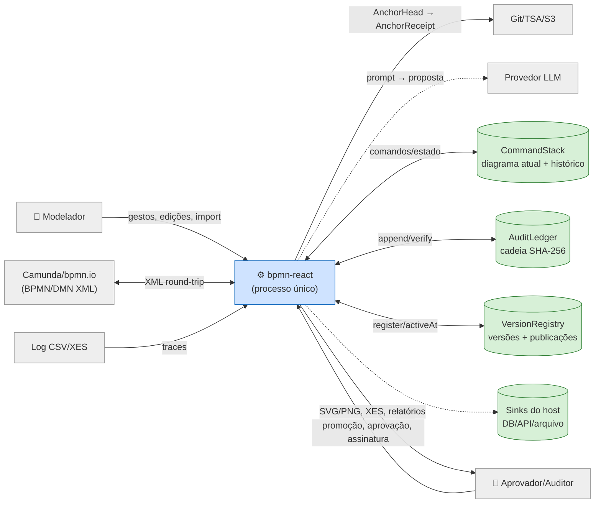
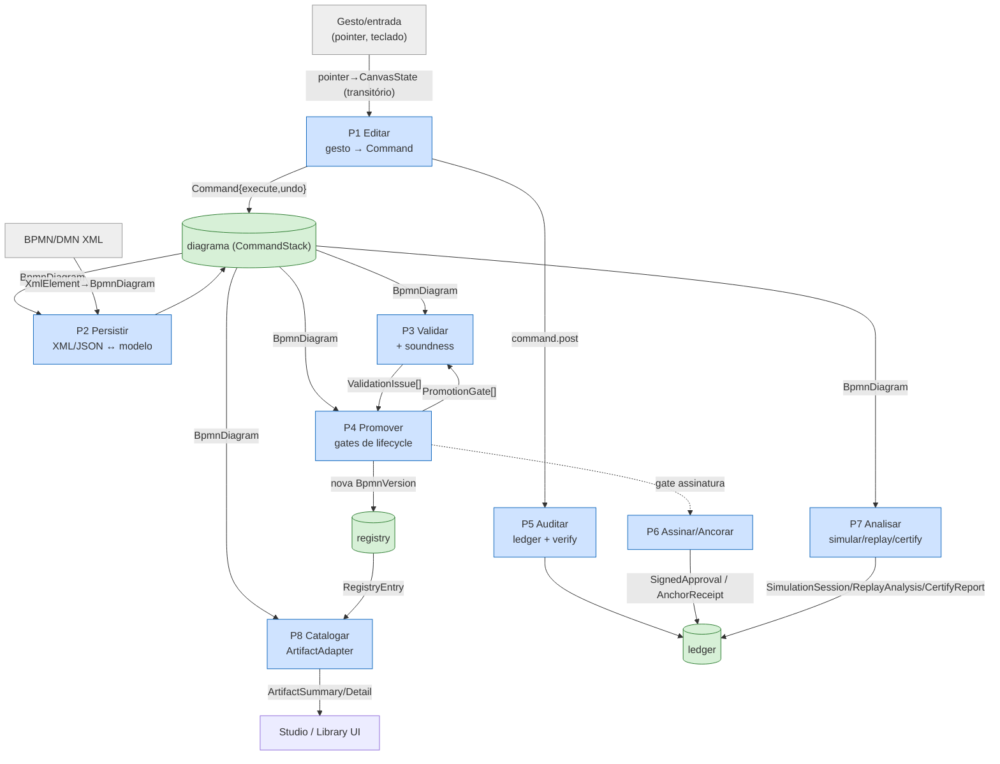

# Mapa de Dados do Sistema — `bpmn-react` (`@buildtovalue/*`)

> **Catálogo completo de todos os dados que circulam no repositório** — dados de
> **entrada**, de **processamento intermediário** (inclusive dados transitórios que
> "se perdem" dentro da própria função/classe) e de **saída**, mapeados arquivo por
> arquivo, para todos os módulos do sistema.
>
> Complementa `docs/uml/` (diagramas UML e de arquitetura C4/4+1). Aqui o foco é
> **o dado**: o que entra, o que é transformado, o que sai, e em que forma trafega.

## Nota de escopo — linguagens presentes

O pedido menciona Rust, Python, TypeScript e HTML. A inspeção recursiva confirma:

| Tipo | Qtd. | Situação |
|---|---|---|
| `.ts` / `.tsx` (TypeScript) | ~490 | **100% da lógica** — todo o dado do sistema trafega aqui |
| `.html` | 1 | `packages/example/index.html` (bootstrap do app-demo Vite) |
| `.css` | 5 | folhas de estilo dos pacotes React (tokens/temas) |
| `.bpmn` (XML) | 50+ | `packages/conformance/corpus/` — **dados de entrada** de teste de interop |
| `.json` / config | vários | `package.json`, `tsconfig`, fixtures |
| `.py` (Python) | **0** | **inexistente** neste repositório |
| `.rs` (Rust) | **0** | **inexistente** neste repositório |

Portanto o mapa cobre **TypeScript** (todo o dado) + os artefatos **HTML/CSS/XML/JSON**
que carregam dados de configuração e de teste. Não há dados circulando em Python/Rust.

## Como este catálogo está organizado

O detalhe **arquivo por arquivo** está dividido em 6 documentos por camada. Cada
arquivo segue o mesmo template: **Papel · Entradas · Processamento (intermediário)
· Saídas · Estruturas de dados que trafegam**.

| Doc | Camada | Pacotes cobertos |
|---|---|---|
| [`01-core.md`](01-core.md) | Domínio | `core` |
| [`02-react-editor-ui.md`](02-react-editor-ui.md) | Apresentação (editor + UI) | `react` (canvas, state, contexts, shapes, gestures, plugins, ui, viewer) |
| [`03-react-features.md`](03-react-features.md) | Apresentação (features) | `react` (simulation, replay, agent, copilot, workers, i18n) |
| [`04-governanca-analise.md`](04-governanca-analise.md) | Governança · Confiança · Análise | `registry`, `audit`, `identity`, `anchor-*`, `conformance`, `soundness`, `replay` |
| [`05-familia-ia.md`](05-familia-ia.md) | Família BPMN · IA | `dmn`, `sfeel`, `healthcare`, `domain-example`, `simulation`, `copilot`, `agentflow` |
| [`06-catalogo-apps.md`](06-catalogo-apps.md) | Catálogo · Aplicações | `library`, `library-react`, `adapters-bpmn`, `studio`, `cli`, `example` |

**Cobertura: 100% dos `src/` dos 24 pacotes** (≈268 arquivos hoje — contagens absolutas
por doc foram removidas de propósito: envelheciam a cada PR; o número vivo é
`find packages/*/src -name '*.ts*' | wc -l`), mais o corpus `.bpmn` (conformance), os
assets HTML/CSS do `example` e os testes/e2e tratados de forma condensada. Mudanças
estruturais recentes são marcadas com blocos `> Δ 2026-07` na entrada do arquivo
correspondente.

## Metodologia

Leitura linha a linha de cada script. Para cada função/classe/constante foram
extraídos: **(E)** entradas — parâmetros, leituras de estado, arquivos/XML, eventos;
**(P)** processamento intermediário — estruturas locais, transformações, hashes,
mapas temporários, acumuladores, dados transitórios que não deixam a função; **(S)**
saídas — retornos, mutações, eventos disparados, escritas, efeitos colaterais.
Arquivos de teste (`*.test.ts`, `e2e/*.spec.ts`) e o corpus `.bpmn` são tratados de
forma condensada (indicando os **dados de fixture** que exercitam), pois são dados de
verificação, não de produção.

---

## 1. Dicionário de dados canônicos (o "sangue" do sistema)

Estas são as estruturas que **atravessam múltiplos módulos** — a espinha de dados
do sistema. (Detalhe de campos: `docs/uml/analise-uml.md §6`.)

### 1.1 Dados de domínio (núcleo, JSON-serializável)

| Dado | Forma | Origem → circula por |
|---|---|---|
| `BpmnDiagram` | `{id,name,description,version,nodes:Record,edges:Record,metadata}` | criado por `factory` → **todos** os pacotes |
| `BpmnNode` | `{id,type,label,x,y,w,h,properties,createdInVersion,removedInVersion?,audit}` | dentro de `BpmnDiagram.nodes` |
| `BpmnEdge` | `{id,type,sourceId,targetId,waypoints?,supersedesEdgeId?,audit}` | dentro de `BpmnDiagram.edges` |
| `BpmnVersion` | `{id,semanticVersion,status,approvedBy,changeSummary,snapshotHash,parentVersionId}` | lifecycle → registry → audit |
| `ApprovalRecord` | `{userId,role,approvedAt,reason}` | lifecycle/identity → version |
| `AuditTrail` / `AuditEventRecord` | trilha local por elemento | dentro de nós/arestas |
| `UserContext` | `{id,role,name?}` | comandos, promoções, ledger |
| `NodeTypeDefinition` | `{type,label,category,defaultSize,xml:{tag},visual?}` | registry → validação/persistência/UI |
| `Point`/`Size`/`Rect` | geometria | canvas, roteamento, DI |

### 1.2 Dados de controle e transformação

| Dado | Forma | Papel |
|---|---|---|
| `Command` | `{id,description,execute,undo,toAuditEvent?}` | unidade de mutação reversível |
| `RuleVerdict` | `{allowed,reason?}` | veto de comando/conexão |
| `PromotionInput` / `PromotionGate` | entrada e checklist de promoção | governança de versão |
| `ValidationResult` / `ValidationIssue` | `{valid,issues[]}` | validação estrutural |
| `BpmnDiff` | `{nodes,edges,metadata}` (ops add/remove/update/supersede) | diff/changelog |
| `FireResult` / event payloads | `{cancelled,payload}` | barramento de eventos |
| `EditorEvent` | `{type,ts,meta}` (catálogo `EDITOR_EVENTS`) | observabilidade do editor |

### 1.3 Dados de persistência, confiança e auditoria

| Dado | Forma | Papel |
|---|---|---|
| `XmlElement` | `{tag,attributes,children,text}` | árvore de parse XML |
| `ImportResult` | `{diagram,warnings[]}` | import BPMN/DMN |
| hash SHA-256 / `canonicalJson` / `canonicalJsonExact` | string | normalização p/ hash/diff — `canonicalJson` arredonda coordenadas (geometria/snapshot); `canonicalJsonExact` preserva números (ledger v2, assinaturas, atestações) |
| `Snapshot` | `{diagram,hash,createdAt,createdBy}` | verificação de conteúdo |
| `AuditEntry` | `{seq,type,...,previousHash,hash,hashVersion?:2}` (cadeia; receita v2 exata, v1 legado verifica p/ sempre) | ledger encadeado |
| `LedgerVerification` / `VerificationReport` | `{valid,brokenAt?}` | verificação de integridade |
| `CanonicalApprovalPayload` / `SignedApproval` | payload + assinatura Ed25519 | aprovação assinada |
| `AnchorHead` / `AnchorReceipt` | head + recibo | ancoragem externa |
| `Attestation` / `AssuranceCase` / XES XML | atestação, caso SACM, log de mineração | export de confiança |
| `RegistryEntry` / `Publication` / `RunBinding` | entrada de registro, publicação, pin de execução | governança consultável |

### 1.4 Dados de análise, família e IA

| Dado | Forma | Papel |
|---|---|---|
| `ScopeGraph` / soundness `ValidationIssue` | grafo por escopo + problemas | análise estrutural |
| `SimulationState` / `Token` / `Decision` / `DecisionOutcome` | estado de tokens | simulação |
| `CoveragePath` / `Scenario` / `SimulationSession` | cobertura e cenário replayável | evidência de simulação |
| `ReplayGraph` / `AggregatedLog` / `ReplayAnalysis` | grafo + log agregado + resumo | replay/conformance |
| `CertifyReport` / `ConformanceEntry` | certificado + matriz | conformidade OMG |
| `DecisionTable` / `EvaluateResult` / `CellCheck` | tabela DMN + avaliação S-FEEL | decisão |
| `AgentWorkflow` / `AutonomyLevel` / `AgentRef` | modelo de agente + autonomia | agentflow |
| `AIProvider` req/resp (`Msg`) / `CopilotProposal` / `CopilotPlan` | pedido/resposta LLM → plano | copiloto |

### 1.5 Dados de apresentação e catálogo

| Dado | Forma | Papel |
|---|---|---|
| `CanvasState` | viewport, selectedIds, focusedElementId, dragState, connectState, resizeState, selectionBox, edgeDrag, boundarySnap, contextMenu, settling, issueBadges, dismissals | **estado visual** (store externo) |
| `EditorConfig` | registry+shapes+engines+router+emit resolvidos dos plugins | configuração do editor |
| `AutosavePayload` | diagrama serializado + timestamp | recuperação |
| `ClipboardPayload` | `{kind:'bpmnr-elements',nodes,edges}` | copiar/colar/duplicar (remap de ids na colagem) |
| `Messages` (i18n) | mapas chave→string (EN/PT_BR) | textos de UI |
| `ArtifactSummary` / `ArtifactDetail` | resumo/detalhe de artefato | catálogo |
| `LibraryQuery` / `LibraryResult` / `LibraryCounts` | consulta + resultado + contagens | busca no catálogo |
| `ThumbnailSpec` | `{kind:'svg'|'icon'|'none'}` | miniatura como dado |

### 1.6 Formatos de dados externos (fronteiras de entrada/saída)

| Formato | Direção | Onde |
|---|---|---|
| **BPMN 2.0 XML** | entra e sai | `core/persistence/BpmnXmlConverter` |
| **DMN 1.3 XML** | entra e sai | `dmn/DmnXmlConverter` |
| **XES 2.0 XML** | sai | `audit/xes` |
| **SACM/HTML** | sai | `audit/sacmReport` |
| **JSON** (diagrama, registro, autosave) | entra e sai | `core/persistence/serializer`, `registry.export`, CLI |
| **CSV / XES** (log de execução) | entra | `replay/parseCsv`, `replay/parseXes` |
| **SVG / PNG** | sai | `react/ui/exporters`, thumbnails |
| **HTML / CSS** | config | `example/index.html`, `*/styles.css` |

---

## 2. Diagrama de Fluxo de Dados — Nível 0 (contexto)

## 3. Diagrama de Fluxo de Dados — Nível 1 (processos internos)

**Leitura:** o dado central é o `BpmnDiagram`, mantido no `CommandStack` (D1). Toda
escrita entra como `Command`; toda leitura de governança sai como nova `BpmnVersion`
imutável (D3) e como entradas de `ledger` (D2). Estado visual transitório
(`CanvasState`) nunca chega a D1 — só o commit no `pointerup` produz `Command`.

---

## 4. Índice de detalhe arquivo-por-arquivo

Prossiga para os documentos por camada (§"Como este catálogo está organizado").
Cada um mapeia entradas, processamento intermediário e saídas de **cada arquivo**
do seu escopo (≈255 seções de arquivo no total).

> _A contagem de arquivos cobertos por documento consta na tabela acima e no topo
> de cada arquivo._
