# Análise UML Completa — `bpmn-react` (monorepo `@buildtovalue/*`)

> Documento gerado por análise estática de **todo** o código-fonte do repositório
> (`packages/*/src`), dos arquivos de configuração de pacote (`package.json`,
> `tsconfig`, `pnpm-workspace.yaml`) e da documentação de arquitetura existente
> (`docs/architecture.md`, `docs/plugins.md`, `README.md`).
>
> Objetivo: mapear **como cada módulo/pacote se conecta ao todo** — dependências,
> fluxos de dados e responsabilidades — para permitir estudo aprofundado de
> arquitetura e refatoramentos futuros.
>
> Todos os diagramas usam **Mermaid** (renderiza nativamente no GitHub). A escolha
> é deliberada: prioriza utilidade imediata no próprio repositório sobre a notação
> UML estrita do PlantUML. Onde a notação Mermaid diverge do UML canônico, a
> legenda de cada seção explica o mapeamento.

---

## 0. Nota crítica sobre o escopo "multi-linguagem"

O prompt de origem pressupõe um repositório **Python + Rust + TypeScript**. A
inspeção recursiva revela que **isso não se aplica a este repositório**:

| Extensão | Arquivos | Observação |
|---|---|---|
| `.ts` | 357 | Lógica de domínio, engines, persistência, CLIs, testes |
| `.tsx` | 118 | Componentes React (canvas, shapes, chrome, painéis) |
| `.py` | 0 | **Ausente** |
| `.rs` | 0 | **Ausente** |
| `.d.ts` | 0 dedicados | Tipos são co-localizados no `.ts` de origem |

Total: **475 arquivos-fonte TypeScript**, `Node >= 20`, gerenciados por **pnpm
workspaces** (`packageManager: pnpm@10.33.0`), em **24 pacotes** publicáveis sob o
escopo `@buildtovalue/*`.

**Consequência para a análise.** As seções específicas de Python (decoradores,
ABCs, metaclasses) e Rust (traits, ownership, `Arc/Mutex`, macros) do prompt
**não têm correspondência** e são justificadamente omitidas (ver §10). Em
compensação, a "fronteira multi-linguagem" real deste sistema é substituída por
três fronteiras internas igualmente relevantes, que este documento trata com o
mesmo rigor:

1. **Fronteira domínio ↔ apresentação** — `@buildtovalue/core` é TypeScript puro,
   *zero dependência de runtime e zero React* (roda em browser, Node e Web
   Workers); `@buildtovalue/react` é a única camada que conhece o DOM/React.
2. **Fronteira de interoperabilidade por formato** — **BPMN 2.0 XML** e **DMN 1.3
   XML** são o "contrato entre linguagens" com ferramentas externas (Camunda
   Modeler, bpmn.io). São o equivalente aos "DTOs compartilhados via geração de
   código" mencionados no prompt.
3. **Fronteira ports & adapters (hexagonal)** — transportes de confiança
   (`Signer`, `AnchorAdapter`, `AIProvider`, `RegistrySink`, `AuditSink`,
   `DecisionEvaluator`) são **injetados pelo host** e nunca implementados dentro
   das bibliotecas. É aqui que o sistema toca rede, criptografia de chave privada
   e LLMs — sempre do lado de fora.

---

## 1. Mapeamento estrutural (top-down)

### 1.1 Mapa de pacotes e responsabilidades

Todos os pacotes são **ESM + CJS dual-build**, `sideEffects:false`. Os pacotes
"shipped" têm **zero dependências de runtime** (garantido em CI por
`scripts/check-no-runtime-deps.mjs`).

| Camada | Pacote | Responsabilidade (1 linha) | Depende de (`@buildtovalue/*`) |
|---|---|---|---|
| **Domínio** | `core` | Engine de domínio: modelo, comandos, eventos, lifecycle, regras, validação, diff, ledger, geometria, XML | — (zero) |
| **Apresentação** | `react` | Canvas SVG, shapes, gestos, chrome do editor, store visual externo, plugins | agentflow, copilot, core, identity, replay, simulation |
| | `example` | App-demo Vite exercitando todos os modos | (quase todos) |
| **Governança** | `registry` | Registro consultável de versões: validade temporal (`activeAt`), canais/ambientes, linhagem, pinagem de execução | core |
| | `audit` | `verifyLedger`, `attestVersion`, `toXES`, assinaturas, caso de garantia SACM | core, identity, registry |
| **Confiança** | `identity` | Assinatura/verificação Ed25519 offline, RBAC, **contrato `AnchorAdapter`** | core |
| | `anchor-git` | Ancora o head do ledger num commit/ref Git | identity |
| | `anchor-rfc3161` | Ancora num token TSA RFC 3161 | identity |
| | `anchor-s3` | Ancora num objeto S3 WORM (object-lock) | identity |
| **Análise** | `soundness` | Análise estrutural (deadlock/livelock/dead-branch) O(V+E) | core |
| | `simulation` | Engine de tokens (XOR/AND/event/boundary), cobertura, cenários | core |
| | `replay` | Token-replay/conformance sobre log de eventos (grafo injetado) | — (zero) |
| | `conformance` | Corpus de interoperabilidade + matriz OMG + `certifyXml` | core |
| **Família BPMN** | `dmn` | Tipos/shapes DRD + conversor DMN 1.3 XML + avaliador de decisão | core, react, sfeel |
| | `sfeel` | Parser/avaliador do subconjunto S-FEEL ("contrato de honestidade") | — (zero) |
| | `healthcare` | Plugin de vocabulário clínico (305°) | core, react |
| | `domain-example` | Plugin-template de domínio (squads/personas/gates) | core, react |
| **IA governada** | `copilot` | Copiloto: `AIProvider` injetado, proposta→comandos whitelisted, prévia de soundness | core, soundness |
| | `agentflow` | Modelo JSON de sub-workflow de agente (llm/tool/decision + autonomia 0–5) | — (zero) |
| **Catálogo** | `library` | Contrato `ArtifactAdapter` + busca/filtro/ordenação headless | — (zero) |
| | `library-react` | Galeria React dirigida pelo contrato | library, react |
| | `adapters-bpmn` | `ArtifactAdapter`s concretos sobre o registry + thumbnails SVG | agentflow, copilot, core, library, registry, replay, simulation |
| **Aplicação** | `studio` | Shell BuildToValue Studio: navegação por hash + fila de revisão do aprovador | audit, conformance, copilot, core, identity, library, library-react, react, registry, soundness |
| | `cli` | CLI headless: `validate`, `certify`, `export`, `diff`, governança | audit, conformance, core, registry, soundness |

### 1.2 Fronteiras de sistema e mecanismos de comunicação

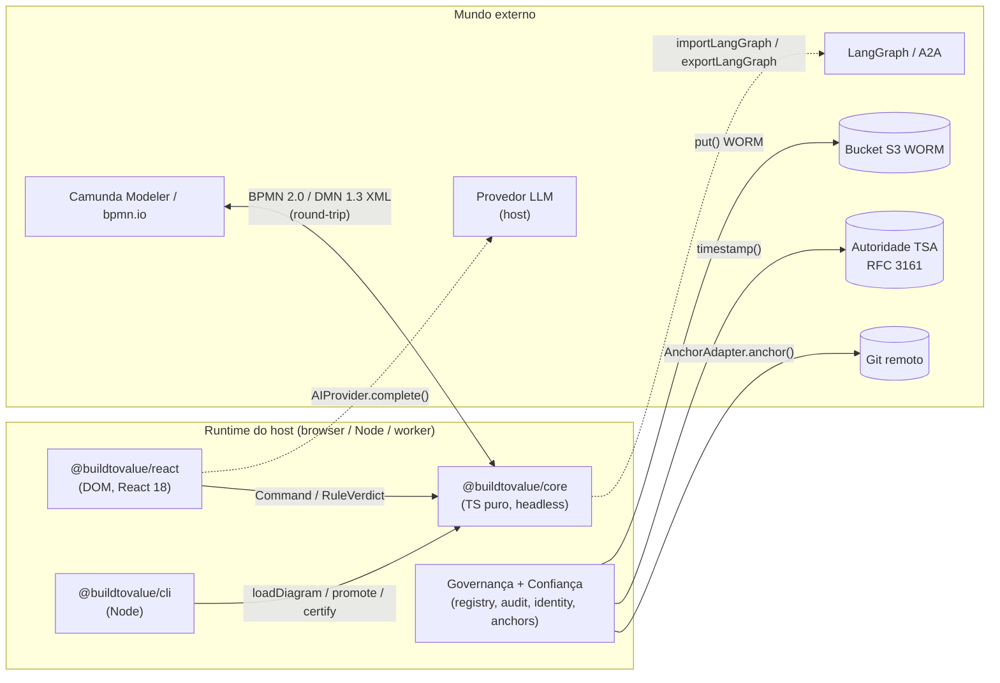

**Notação:** setas cheias = chamada síncrona/contrato compilado; setas tracejadas
= transporte **injetado pelo host** (a biblioteca define a *porta*, o host provê o
*adaptador*). O XML é o único canal bidirecional de dados entre "linguagens"
(ferramentas externas).

Não há **REST/gRPC/WebSocket** entre os pacotes: tudo é **in-process** (chamadas de
função sobre estruturas imutáveis). A única concorrência real é (a) o **Web Worker
executor** (`packages/react/src/workers/`) para trabalho off-main-thread e (b) a
**fila de Promises** interna do `AuditLedger`/`VersionRegistry` que serializa
escritas. Ver §8.

### 1.3 Dependências externas (por gerenciamento de pacote)

- **Runtime (shipped):** **nenhuma** em `core`, `registry`, `audit`, `identity`,
  `anchors`, `replay`, `library`, `agentflow`, `sfeel`, `soundness`,
  `simulation`, `conformance`, `copilot`. `react`/`library-react`/`dmn`/
  `healthcare`/`domain-example` têm apenas `react`/`react-dom` como **peerDependencies**.
- **Dev/toolchain (raiz):** `typescript ^5.7`, `vitest ^3.2`, `@vitest/coverage-v8`,
  `eslint ^9` + `typescript-eslint`, `prettier`, `typedoc` + `typedoc-plugin-markdown`,
  `jsdom`, `@testing-library/react`, `axe-core`, `react ^18.3`.
- **Guardas de CI** (`scripts/`): `check-no-runtime-deps`, `check-no-key-generation`,
  `check-no-hardcoded-strings`, `check-docs-fresh`; mais `pnpm audit --audit-level=high`.

---

## 2. Padrões arquiteturais detectados

| Padrão | Onde | Evidência |
|---|---|---|
| **Command** (reversível, puro) | `core/commands` | `Command { execute, undo, toAuditEvent? }`; fábricas `addNodeCommand`, `moveNodeCommand`, … |
| **Command Stack + cursor git-like** | `CommandStack` | executar após `undo` descarta o "futuro"; `limit=200` |
| **Composite** | `compositeCommand(...)` | agrupa operações de gesto em um passo de undo |
| **Interceptor / Chain of Responsibility** | `RuleEngine implements CommandInterceptor` | veto `command.pre` antes de mutar |
| **Observer com prioridade + veto + transform** | `EventBus` | handler retorna `false` cancela, valor≠undefined transforma payload |
| **Registry** | `NodeTypeRegistry` | autoridade de tipos; plugins registram tipos custom |
| **Plugin declarativo** | `BpmnPlugin` (react) | objeto puro: `nodeTypes`, `shapes`, `paletteItems`, `validationRules`, `registerRules`, `edgeRouter`, `lifecycleConfig`, hooks |
| **Factory functions** | `factory.ts`, `commands.ts`, `create*Adapter` | tudo criado por função, sem `new` no consumidor |
| **Repository + imutabilidade temporal** | modelo + registry | elementos nunca deletados fora de `draft`: `removedInVersion`, `supersedesEdgeId` |
| **State machine governada** | `LifecycleEngine` | `DEFAULT_TRANSITIONS`; ausência deliberada de `deprecated→active` |
| **Ledger com hash-chain** | `AuditLedger` | SHA-256 encadeado; `verify()` detecta adulteração |
| **Ports & Adapters (hexagonal)** | transportes injetados | `Signer`, `AnchorAdapter`, `AIProvider`, `RegistrySink`, `AuditSink`, `DecisionEvaluator`, `XmlParserAdapter`, `Serializer` |
| **Strategy** | roteadores de aresta | `bezier` / `orthogonal` / `straight` / `astar` / função custom |
| **Facade** | `BpmnXmlConverter`, `DmnXmlConverter` | orquestram serializer/deserializer/DI/extension internos |
| **External store / seletor granular** | `createStore` + `useCanvasState` | `useSyncExternalStore` com `shallowEqual` |
| **CQRS-ish (read model)** | `registry` vs `core` | `VersionRegistry` é modelo de leitura consultável sobre versões imutáveis |
| **Dependency Inversion (seams)** | `agentTask`, `copilot`, `simulation` | `PromotionRule`, `DecisionEvaluator`, `AIProvider` evitam imports concretos |

**Camadas identificadas** (de baixo para cima, cf. `docs/architecture.md`):
domínio (`core`) → governança/confiança/análise → família BPMN & IA →
apresentação (`react`) → catálogo → aplicação (`studio`, `cli`). Entidades de
**domínio** (`BpmnNode`, `BpmnEdge`, `BpmnVersion`) são estritamente separadas de
**infraestrutura** (XML, hash, anchors) e **aplicação** (studio/cli/example).

---

## 3. Diagrama de Casos de Uso

**Objetivo:** identificar atores e as funcionalidades principais do sistema.
**Escopo:** todo o toolkit, do desenho ao selo de auditoria.

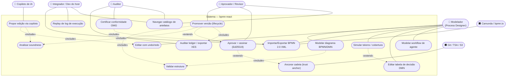

**Notas de design:**
- **Modelador** dispara a maioria dos casos de escrita; toda edição passa por
  `Command` (auditável, reversível). A validação (`UC3`) é `«include»` da modelagem
  e da promoção — um único ponto de verdade (`ValidationEngine`).
- A **promoção** (`UC7`) é o coração da governança: inclui validação e soundness,
  e *estende-se* com assinatura (`UC8`) e ancoragem (`UC9`) quando o host injeta
  `Signer`/`AnchorAdapter`. Aprovar **nunca ativa** — regra de negócio explícita
  do `studio/review/decide.ts`.
- **Copiloto de IA** é ator de sistema, restrito ao caminho de proposta→comando
  *whitelisted* (`UC15`): jamais promove, aprova ou assina (imposto por CI —
  `copilot` não tem caminho de import para `identity`).

---

## 4. Diagrama de Pacotes

**Objetivo:** organização lógica e dependências entre pacotes.
**Escopo:** os 24 pacotes do workspace. Setas = "depende de" (runtime, salvo nota).

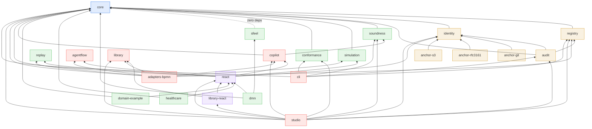

**Notas de design:**
- **`core` é a raiz de tudo** (in-degree máxima, out-degree zero) — o *stable
  dependencies principle* está respeitado: quanto mais dependido, mais estável e
  abstrato.
- **Três pacotes têm zero dependências** propositalmente: `sfeel`, `agentflow` e
  `replay` (e `library`). São ilhas reutilizáveis — `replay` raciocina sobre um
  grafo *injetado* (`ReplayGraph`), não sobre `BpmnDiagram`, e por isso nem
  importa `core`.
- **Acoplamento aferente perigoso?** `react` depende de 6 pacotes (incl.
  `copilot`, `agentflow`, `simulation`, `replay`) — é o maior fan-out da camada de
  apresentação. Ver §11 (oportunidade de extrair sub-pacotes `react/*`).
- **`adapters-bpmn` é dependência de runtime de ninguém** neste conjunto (só
  devDep de `library-react` e `studio`): os adaptadores concretos são
  *injetados pelo host* em `LibraryView.adapters` / `StudioShell.library`.
- `simulation → dmn → sfeel` **não é** dependência de compilação: é uma cadeia de
  *injeção em runtime* (o host passa `createSfeelDecisionSupport(diagram)` como
  `SimulationOptions.decisions`). `simulation` define a porta `DecisionEvaluator`;
  `dmn` a satisfia estruturalmente sem importar `simulation`.

---

## 5. Diagrama de Componentes

**Objetivo:** componentes de software em runtime e suas interfaces de comunicação.
**Escopo:** um host típico (editor + governança) mais o CLI e serviços externos.

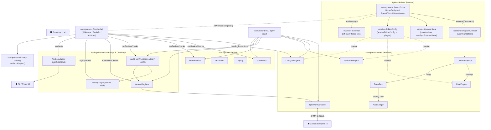

**Interfaces de comunicação (portas):**

| Porta (interface) | Definida em | Implementada por | Protocolo |
|---|---|---|---|
| `Command` / `CommandInterceptor` | `core/commands` | `RuleEngine`, fábricas de comando | in-process |
| `EventHandler` (bus) | `core/events` | `AuditLedger`, listeners de plugin | in-process, síncrono |
| `XmlParserAdapter` | `core/xml/adapter` | `MiniXmlAdapter`, `DomXmlAdapter` | in-process |
| `Serializer<T>` | `core/persistence` | `JsonSerializer` | in-process |
| `AnchorAdapter` | `identity` | `anchor-git/rfc3161/s3` (transporte injetado) | Git / TSA / S3 |
| `Signer` | `identity` | host (chave privada nunca cruza) | Web Crypto |
| `AIProvider` | `copilot` | host | LLM (fora da lib) |
| `RegistrySink` / `AuditSink` | `registry` / `core` | host (DB/API/arquivo) | persistência |
| `DecisionEvaluator` | `simulation` | `dmn` (via `sfeelSupport`) | injeção runtime |
| `ArtifactAdapter` | `library` | `adapters-bpmn` | in-process |

**Notas de design:** o `EventBus` é o único hub de eventos e é **interno ao
`core`** — a camada React **não** o consome; a observabilidade do editor usa o
canal separado `onEditorEvent` (catálogo `EDITOR_EVENTS`, contrato semver). O
`AuditLedger` conecta-se ao `CommandStack` como *listener de baixa prioridade
(−100)*, garantindo que observa o payload final após transformações.

---

## 6. Diagramas de Classe (por camada)

Quebrados em subdiagramas para legibilidade (critério de "clareza" do prompt).
**Legenda Mermaid → UML:** `..|>` realização (implements) · `--|>` herança ·
`*--` composição · `o--` agregação · `-->` associação · `..>` dependência ·
`<<interface>>` estereótipo.

### 6.1 Camada de Domínio — modelo `«entity»` / `«value-object»`

**Objetivo:** as estruturas de dados imutáveis e serializáveis que todo o sistema
compartilha. **Origem:** `packages/core/src/model/types.ts`.

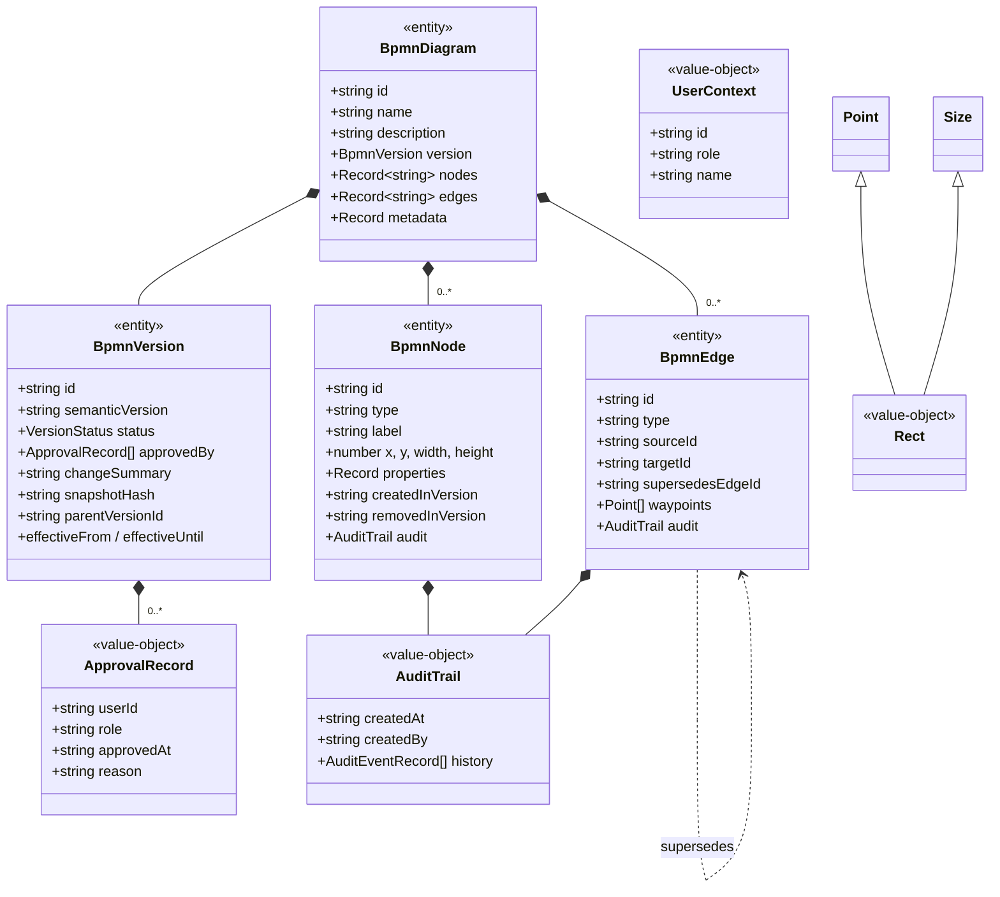

**Notas:** `nodes`/`edges` são **dicionários** (`Record<id,…>`) — O(1) em pointer
handling de 60fps e ids duplicados impossíveis por construção. Datas são strings
ISO-8601 → todo o modelo é JSON-serializável e determinístico para hash/diff. A
**imutabilidade temporal** aparece como as associações opcionais
`removedInVersion` e `supersedesEdgeId` (arestas formam cadeia de substituição,
navegável por `getEdgeChain`).

### 6.2 Núcleo de controle — Command / Event / Rule / Lifecycle

**Objetivo:** o motor de mutação, undo/redo, veto e promoção.

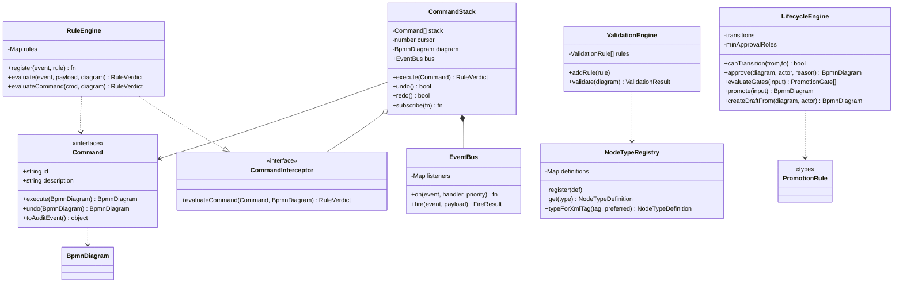

**Notas:** `Command` e `CommandInterceptor` são **interfaces na camada `commands`**
que a camada `engine` (`RuleEngine`) *implementa* — inversão de dependência
deliberada: `commands` nunca depende de `engine`. `LifecycleEngine.promote`
avalia *gates* (transição, aprovações, changelog, diff, `promotionRules`
injetadas) e lança o `detail` do primeiro gate insatisfeito — fonte única de
verdade que a UI renderiza como checklist.

### 6.3 Persistência & pipeline XML (`«service»` internos)

**Objetivo:** o round-trip BPMN 2.0 XML — a fronteira de interoperabilidade.

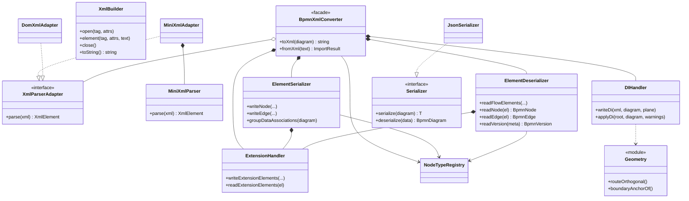

**Notas:** `BpmnXmlConverter` é um **Facade** fino sobre quatro colaboradores
internos (não reexportados no `index.ts` — detalhes de implementação). A
segurança está aqui: `MiniXmlParser` rejeita `<!DOCTYPE>`/DTD (imune a XXE), e
`XmlBuilder` escapa atributos e texto. Propriedades de domínio viajam em
`extensionElements` (`bpmnr:meta` / `bpmnr:property`), preservando identidade
enquanto o tag exportado permanece BPMN padrão → interoperável.

### 6.4 Governança & Confiança

**Objetivo:** registro de versões, verificação de ledger, assinatura e ancoragem.

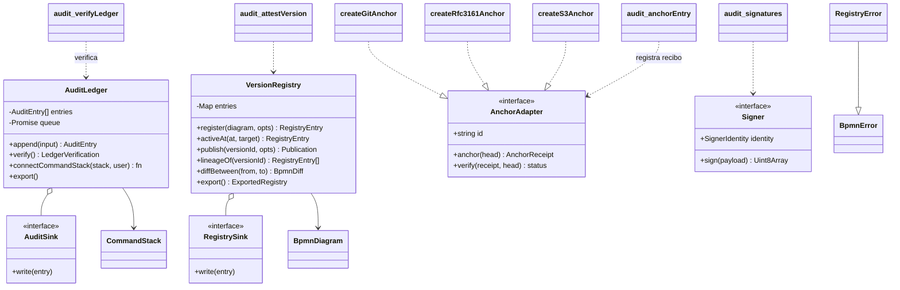

**Notas:** `identity` **nunca gerencia chaves** (o host implementa `Signer`; a
chave privada jamais cruza a fronteira — imposto por `check-no-key-generation`).
Os três pacotes `anchor-*` implementam o **mesmo contrato `AnchorAdapter`** via
transporte injetado (nenhuma rede dentro da lib). O recibo de `anchor()` vira uma
entrada de ledger (`anchorRecordedEntry`), fechando o loop entre confiança e
auditoria.

### 6.5 Apresentação React — store, contextos, plugin

**Objetivo:** a separação de estado visual vs. domínio e o ponto de extensão.

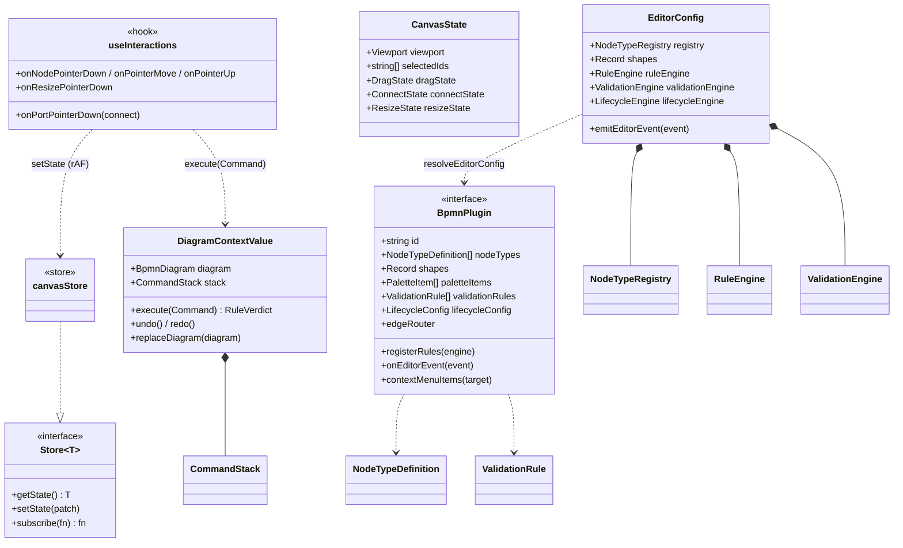

**Notas:** **dois estados, dois contêineres.** O estado de **domínio** (o diagrama)
vive no `CommandStack` (baixa frequência, undo-able, exposto por `DiagramContext`);
o estado **visual** (viewport, seleção, gestos em voo) vive num *store externo
minúsculo* consumido por `useCanvasState(selector)` — componentes re-renderizam só
quando a fatia selecionada muda (arrastar um nó não re-renderiza a árvore toda). O
`BpmnPlugin` é um **objeto declarativo puro** — sem DI, sem classes de ciclo de
vida; `resolveEditorConfig(plugins)` funde tudo num `EditorConfig`.

### 6.6 Catálogo de artefatos & IA (contrato `ArtifactAdapter`, agentflow, copilot)

**Objetivo:** o contrato genérico de catálogo e o modelo de agente/copiloto.

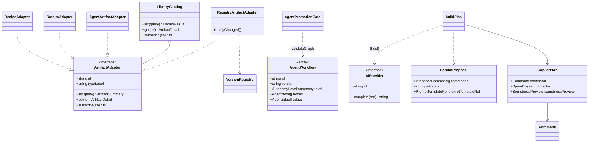

**Notas:** o `ArtifactAdapter` é a **espinha de vocabulário** do Studio — `library`
não conhece BPMN; `adapters-bpmn` fornece 10+ adaptadores concretos (flow,
persona, prompt, connector, policy, DMN decision, agente, roteiro, copilot-prompt,
recipe). O `copilot` transforma texto do `AIProvider` em **um** `compositeCommand`
undo-able, com prévia de soundness calculada localmente — a IA nunca escreve no
diagrama diretamente nem acessa comandos de governança (whitelist de 7 comandos de
edição de rascunho).

---

## 7. Diagramas de Sequência

### 7.1 Editar um nó (gesto → comando → veto → auditoria → re-render)

**Objetivo:** o loop de escrita completo, síncrono, com veto e auditoria.

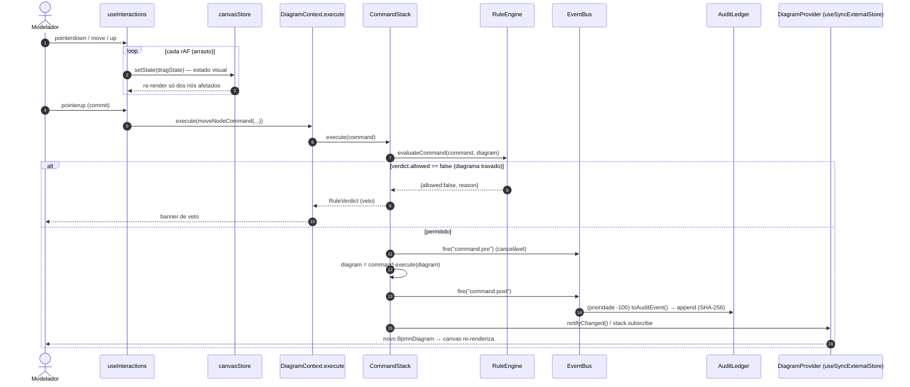

**Notas:** o estado **visual** muda a cada `requestAnimationFrame` sem tocar o
domínio; só no `pointerup` um `Command` é confirmado. O `AuditLedger` observa em
prioridade −100 (após transformadores), garantindo payload final. Chamadas são
**síncronas** exceto o `append` do ledger (serializado por fila de Promise).

### 7.2 Importar BPMN 2.0 XML

**Objetivo:** o caminho de leitura da fronteira de interoperabilidade.

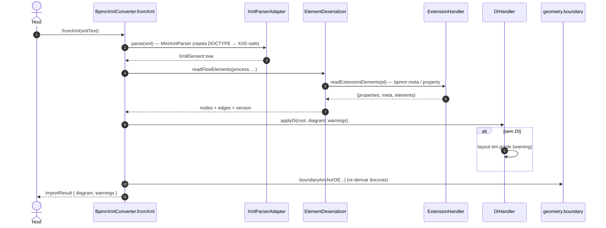

**Notas:** elementos desconhecidos são **ignorados com warning** (não rejeitados) —
interoperabilidade tolerante. `readNode` resolve o tipo via metadados
(`bpmnr:meta`) ou `registry.typeForXmlTag` com `preferredTypes` dos plugins.

### 7.3 Promover versão (avaliação de gates)

**Objetivo:** a decisão de governança central.

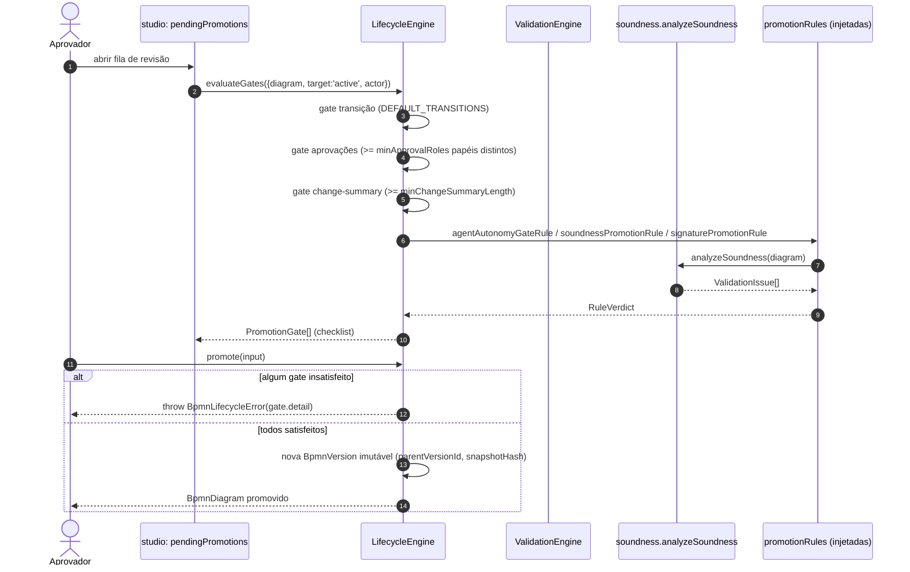

**Notas:** a UI **nunca duplica** as regras — renderiza os `PromotionGate[]` que a
engine devolve. Cada promoção cria uma **nova versão imutável** encadeada; a
versão anterior nunca é mutada.

### 7.4 Aprovar + assinar + ancorar (Studio Review)

**Objetivo:** confiança criptográfica ponta-a-ponta (assíncrona).

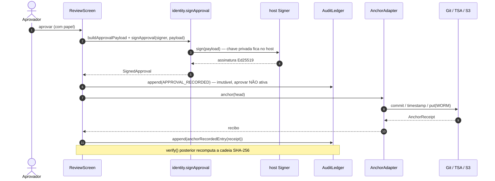

**Notas:** três chamadas `await` reais (assinar, ancorar, persistir). O
`verify()` do ledger e o `AnchorAdapter.verify()` são independentes: um banner de
âncora (N-4) mostra `anchored | pending | mismatch | none` sem bloquear a UI.

### 7.5 Simular tokens & proposta do copiloto (resumidas)

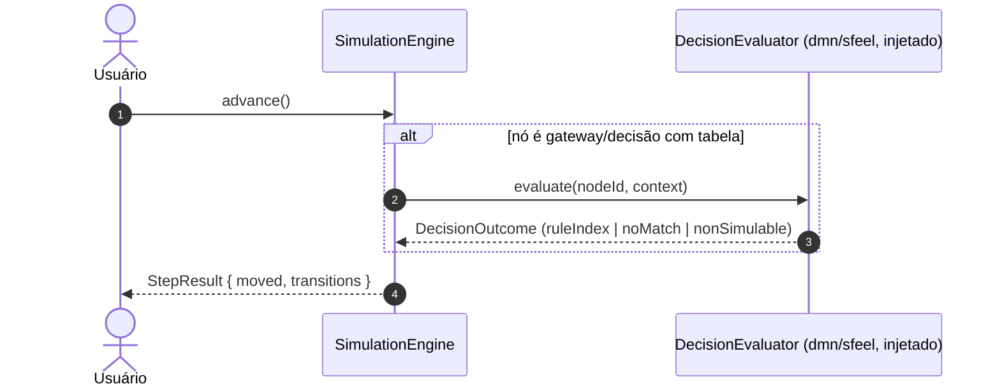

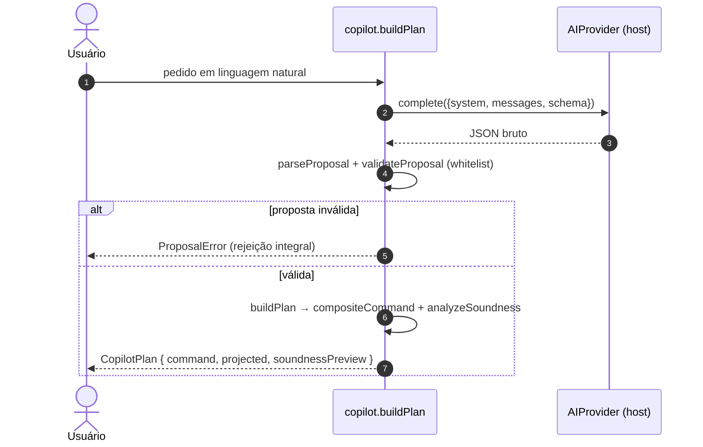

**Notas:** o `DecisionEvaluator` é a *porta* que desacopla `simulation` de
`dmn`/`sfeel`. No copiloto, **uma** proposta inválida em qualquer índice rejeita o
lote inteiro ("rejeição integral") — e o plano final é sempre **um** comando
composto reversível.

---

## 8. Diagramas de Atividade / Estado

### 8.1 Máquina de estados do ciclo de vida da versão

**Objetivo:** o workflow governado de promoção (state machine configurável).

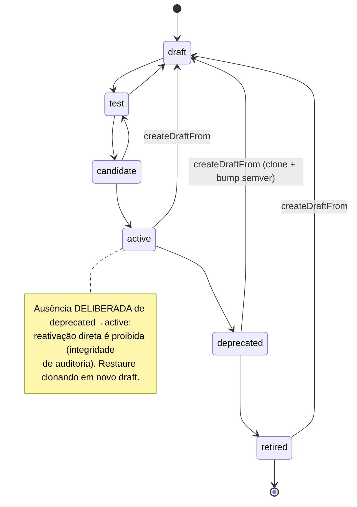

### 8.2 Atividade — avaliação de gates de promoção (múltiplos caminhos)

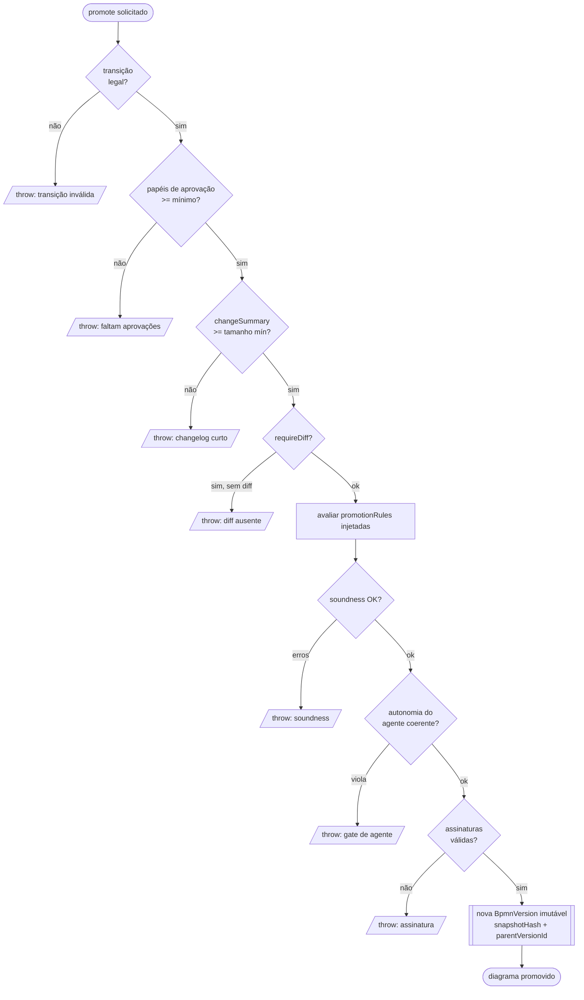

### 8.3 Nota sobre concorrência (por que não há diagrama de atividade concorrente complexo)

O sistema é **single-threaded JavaScript**. Não há `Arc/Mutex`, threads ou
paralelismo real de domínio. As duas únicas formas de concorrência são:

1. **Fila de Promises** em `AuditLedger` e `VersionRegistry` — serializa escritas
   assíncronas (`private queue: Promise<unknown>`), garantindo append atômico do
   hash-chain. É uma *sincronização*, não paralelismo.
2. **Web Worker** (`packages/react/src/workers/executor.ts` + `jobs.ts`) — descarrega
   jobs pesados (ex.: roteamento A*) da main thread via `postMessage`.

Como o prompt permite justificar a ausência: **não há workflow concorrente com
sincronização/exceções paralelas a modelar** além do fluxo linear de gates (§8.2)
e do gerenciamento de fila acima. O diagrama de atividade complexo seria
artificial.

---

## 9. Diagrama de Implantação / Distribuição

**Objetivo:** topologia de distribuição e runtime. **Aplicabilidade:** o
repositório **não** contém Docker/Kubernetes/IaC — é uma **biblioteca npm** (+ app
demo Vite + CLI + pipeline CI). O diagrama abaixo mostra a topologia de
*distribuição e execução* em vez de servidores.

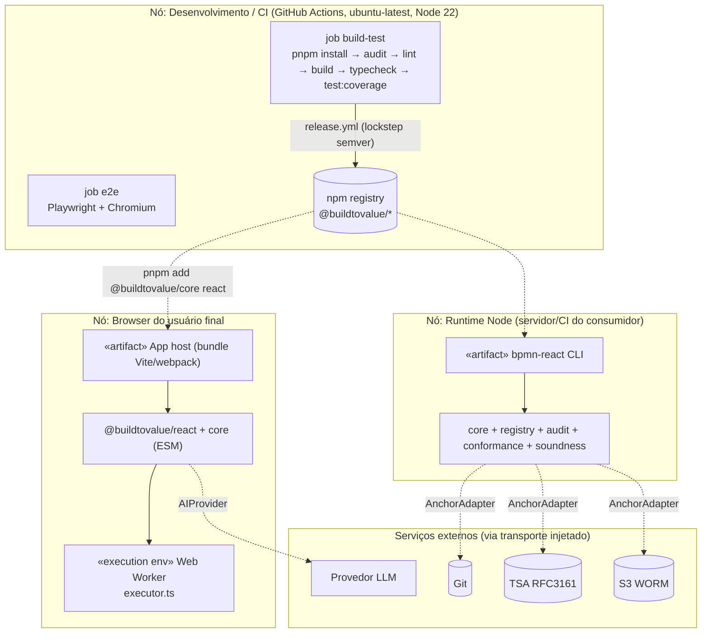

**Notas de design:** distribuição em **lockstep semver** a partir de `1.0.0`; a
superfície pública é congelada por *contract tests* (`apiSurface.test.ts`) e a
freshness dos docs por CI (`check-docs-fresh`). Como todos os pacotes shipped são
zero-runtime-dep, o "deploy" do consumidor é simplesmente o bundle — não há
processo servidor próprio. Serviços externos só são tocados por adaptadores que o
**host** injeta.

---

## 10. Observações por linguagem

| Linguagem | Situação neste repositório |
|---|---|
| **Python** | **Ausente.** Nenhum `.py`. Itens do prompt (decoradores, ABCs, metaclasses, duck typing) não se aplicam. |
| **Rust** | **Ausente.** Nenhum `.rs`. Itens do prompt (traits, ownership/borrowing, `Arc/Rc`, `Mutex/RwLock`, enums algébricos, macros) não se aplicam. |
| **TypeScript** | **100% do código.** Pontos de atenção efetivamente presentes ↓ |

**TypeScript — pontos de atenção realmente exercitados:**
- **Tipos/interfaces compartilhados como contrato** (o análogo TS aos "DTOs
  cross-language"): `BpmnDiagram`/`BpmnNode`/`BpmnEdge` fluem por *todos* os
  pacotes; `ArtifactAdapter`, `AnchorAdapter`, `Command`, `BpmnPlugin` são
  contratos estruturais que múltiplos pacotes implementam **sem** herança nominal
  (duck typing estrutural do TS — ex.: `dmn` satisfaz `DecisionEvaluator` sem
  importar `simulation`; `agentflow` espelha `simTypes` da `simulation`).
- **Uniões discriminadas / ADT-like** (o análogo TS aos enums de Rust): `NodeDiffOp`,
  `EdgeDiffOp`, `Decision`, `ThumbnailSpec`, `ProposalValidation`,
  `LedgerQueryResult` — todos unions com `kind`/`type` como discriminante.
- **Genéricos**: `Store<T>`, `Serializer<T>`, `EventHandler<T>`, `Rule<T>`.
- **`const` tuples + `typeof[number]`** para enums fechados e seguros
  (`VERSION_STATUS`, `EVENT_DEFINITION_KINDS`, `EDITOR_EVENTS`,
  `LIFECYCLE_STATUSES`).
- **Decorators**: **não usados** (o projeto evita metaprogramação; plugins são
  objetos declarativos, não classes decoradas — diferente de NestJS).
- **ESM `.js` specifiers** em imports internos (compat NodeNext).

---

## 11. Análise crítica: coesão, acoplamento e refatoração

### 11.1 Pontos fortes (alta coesão, baixo acoplamento)

- **`core` como núcleo estável zero-dep** com out-degree zero: exemplar do
  *Stable Abstractions Principle*. Roda headless em browser/Node/worker.
- **Inversão de dependência consistente via seams**: `CommandInterceptor`,
  `PromotionRule`, `DecisionEvaluator`, `AIProvider`, `AnchorAdapter`, `Signer`,
  `XmlParserAdapter`, `Serializer` — cada acoplamento potencialmente pesado é
  mediado por uma interface pequena. `simulation` não conhece `dmn`; `copilot`
  não conhece `identity`; `replay` não conhece `core`.
- **Imutabilidade + comandos puros** tornam undo/redo, diff e hash triviais e
  determinísticos; a auditoria é um *observer*, não um acoplamento intrusivo.
- **Fronteira visual/domínio limpa** na camada React (store externo vs.
  `CommandStack`), com re-render granular — decisão de performance que também é
  decisão de arquitetura.
- **Segurança como propriedade estrutural**: XXE-safe por construção, chave
  privada fora da lib, ledger encadeado, tudo verificado em CI.

### 11.2 Pontos de atenção / oportunidades de refatoramento

1. **`packages/react` é grande (143 arquivos) e com fan-out alto** (depende de
   `copilot`, `agentflow`, `simulation`, `replay`, `identity`). Reexporta
   simulação, replay, copiloto e agente pelo mesmo `index.ts`. *Sugestão:* extrair
   subpacotes tree-shakeable (`@buildtovalue/react-simulation`,
   `-replay`, `-copilot`) ou entry points secundários (já há precedente:
   `@buildtovalue/react/viewer`). Reduz o custo de bundle de quem só quer o editor.
2. **Classificação de fluxo duplicada** entre `soundness/graph.ts` e
   `simulation/graph.ts` (`isFlowNode`, `flowScopeOf`, `gatewayKindOf`),
   deliberadamente mantida para preservar o dep `core`-only e "pinada igual" por
   teste. *Sugestão:* promover essas funções para `core` (ex.:
   `core/graph`) e eliminar a duplicação sem quebrar o zero-dep — ambos já
   dependem de `core`.
3. **`agentflow` reimplementa tipos de simulação** (`simTypes.ts` espelha
   `simulation/types.ts`). Estruturalmente compatível, porém frágil a drift.
   *Sugestão:* um micropacote `@buildtovalue/sim-contracts` com só os tipos.
4. **`example` depende de quase tudo** (16 pacotes) — aceitável para um demo, mas
   convém marcá-lo `private:true` (já é) e mantê-lo fora de qualquer grafo de
   release.
5. **`studio` tem in-degree de contexto alto** (10 deps): concentra governança +
   UI + verificação. É o ponto mais acoplado da camada de aplicação; monitorar
   para que não vire *god package*. A separação atual em `review/` e `ledger/`
   ajuda; manter cada tela sobre suas próprias funções puras (`queue`, `checks`,
   `decide`, `categorize`).
6. **Contrato `EDITOR_EVENTS` com aliases deprecados** (`DEPRECATED_EVENT_ALIASES`)
   — bem gerido por semver, mas exige disciplina de remoção no próximo major para
   não acumular dívida de compatibilidade.
7. **`BpmnPlugin` está na camada `react`**, não em `core`, embora carregue campos
   headless (`validationRules`, `registerRules`, `lifecycleConfig`, `edgeRouter`).
   Isso força pacotes headless-conceituais (`dmn`) a depender de `react` só pelo
   tipo do plugin. *Sugestão:* separar um `HeadlessPlugin` (regras, tipos,
   lifecycle) em `core`, do qual `BpmnPlugin` (shapes, palette, inspector) estende
   em `react`. Removeria o dep `react` de `dmn` no caminho headless.

### 11.3 Métricas qualitativas de acoplamento (aferente/eferente)

| Pacote | Ca (dependido por) | Ce (depende de) | Instabilidade I=Ce/(Ca+Ce) | Leitura |
|---|---|---|---|---|
| `core` | ~15 | 0 | **0.0** | máxima estabilidade (correto) |
| `identity` | 4 | 1 | 0.2 | estável (base de confiança) |
| `registry` | 4 | 1 | 0.2 | estável |
| `soundness` | 4 | 1 | 0.2 | estável |
| `react` | 5 | 6 | 0.55 | zona equilibrada, mas volumosa |
| `studio` | 0 | 10 | **1.0** | instável (topo de aplicação — esperado) |
| `cli` | 0 | 5 | **1.0** | instável (topo — esperado) |

O grafo respeita a *Stable Dependencies Principle*: dependências apontam na
direção da estabilidade crescente (aplicação → domínio). Nenhum ciclo de
dependência entre pacotes foi detectado.

---

## 12. Rastreabilidade (entidade → arquivo-fonte)

Índice abreviado das entidades mais relevantes (case-sensitive, como no código):

| Entidade | Arquivo |
|---|---|
| `BpmnDiagram`, `BpmnNode`, `BpmnEdge`, `BpmnVersion` | `packages/core/src/model/types.ts` |
| `NodeTypeRegistry`, `BUILT_IN_NODE_TYPES` | `packages/core/src/model/registry.ts` |
| `CommandStack` | `packages/core/src/commands/CommandStack.ts` |
| `Command`, `CommandInterceptor` | `packages/core/src/commands/types.ts` |
| `EventBus` | `packages/core/src/events/EventBus.ts` |
| `RuleEngine` | `packages/core/src/engine/rules.ts` |
| `LifecycleEngine`, `DEFAULT_TRANSITIONS` | `packages/core/src/engine/lifecycle.ts` |
| `ValidationEngine`, `BUILT_IN_VALIDATION_RULES` | `packages/core/src/engine/validation.ts` |
| `AuditLedger`, `computeEntryHash` | `packages/core/src/audit/ledger.ts` |
| `BpmnXmlConverter` | `packages/core/src/persistence/BpmnXmlConverter.ts` |
| `MiniXmlParser`, `XmlBuilder`, `XmlParserAdapter` | `packages/core/src/xml/` |
| `computeDiff`, `normalizeForDiff` | `packages/core/src/diff/index.ts` |
| `routeAStar`, `routeOrthogonal`, `boundaryAnchorOf` | `packages/core/src/geometry/` |
| `VersionRegistry`, `bindRun` | `packages/registry/src/VersionRegistry.ts`, `runBinding.ts` |
| `verifyLedger`, `attestVersion`, `toXES`, `buildAssuranceCase` | `packages/audit/src/` |
| `AnchorAdapter`, `Signer`, `signApproval` | `packages/identity/src/` |
| `createGitAnchor` / `createRfc3161Anchor` / `createS3Anchor` | `packages/anchor-*/src/` |
| `analyzeSoundness`, `soundnessPromotionRule` | `packages/soundness/src/` |
| `SimulationEngine`, `DecisionEvaluator` | `packages/simulation/src/` |
| `aggregate`, `summarizeReplay` | `packages/replay/src/` |
| `certifyXml`, `CONFORMANCE_MATRIX` | `packages/conformance/src/` |
| `DmnXmlConverter`, `dmnPlugin`, `createSfeelDecisionSupport` | `packages/dmn/src/` |
| `parseUnaryTests`, `evaluate` (S-FEEL) | `packages/sfeel/src/` |
| `BpmnPlugin`, `EDITOR_EVENTS` | `packages/react/src/plugins/types.ts` |
| `BpmnDesigner` / `BpmnEditor` / `BpmnViewer` | `packages/react/src/` |
| `useInteractions`, `canvasStore`, `useCanvasState` | `packages/react/src/canvas/`, `state/`, `contexts/` |
| `ArtifactAdapter`, `createLibraryCatalog` | `packages/library/src/` |
| `LibraryView`, `useLibrary` | `packages/library-react/src/` |
| `createRegistryAdapter`, `dmnDecisionAdapter`, thumbnails | `packages/adapters-bpmn/src/` |
| `AIProvider`, `buildPlan`, `COPILOT_PROMPTS` | `packages/copilot/src/` |
| `AgentWorkflow`, `validateGraph`, `AUTONOMY_SCALE` | `packages/agentflow/src/` |
| `StudioShell`, `pendingPromotions`, `runReviewChecks`, `LedgerExplorer` | `packages/studio/src/` |
| `validateCommand`, `certifyCommand`, `promoteCommand` | `packages/cli/src/` |

---

## 13. Checklist do agente

- [x] Mapeou todos os arquivos `.ts`/`.tsx` (475 fontes; `.py`/`.rs` inexistentes, ver §0)
- [x] Extraiu dependências dos arquivos de config (`package.json`, `pnpm-workspace.yaml`, `tsconfig`)
- [x] Identificou fronteiras entre camadas e mecanismos de comunicação (§1.2, §5) — sem REST/gRPC; XML como contrato de interop; portas injetadas
- [x] Gerou os diagramas UML: Casos de Uso (§3), Pacotes (§4), Componentes (§5), Classes ×6 por camada (§6), Sequência ×5 (§7), Atividade/Estado ×2 (§8), Implantação/Distribuição (§9)
- [x] Usou Mermaid em todos os diagramas (renderização nativa no GitHub)
- [x] Incluiu notas de design e pontos de atenção para refatoramento (§2, §11)
- [x] Quebrou diagramas complexos (classes divididas em 6 subdiagramas por camada)
- [x] Manteve nomes e estruturas fiéis ao código-fonte (case-sensitive; §12 rastreabilidade)
- [x] Justificou ausências (Python/Rust §0/§10; deployment IaC §9; atividade concorrente §8.3)
