# Arquitetura — `bpmn-react` (monorepo `@buildtovalue/*`)

> Documentação de arquitetura **completa** deste repositório, organizada segundo
> os frameworks recomendados: **Modelo C4** (Contexto → Contêiner → Componente →
> Código), **Vistas 4+1** (Lógica, Processo, Desenvolvimento, Física, Cenários),
> **Atributos de Qualidade (-ilities)** e princípios **SOLID / Leis da Arquitetura**.
>
> Complementa `docs/uml/analise-uml.md` (diagramas UML por notação). Aqui o foco é
> **arquitetura** — decisões estruturais, atributos de qualidade e recomendações.
>
> Escopo: 24 pacotes publicáveis, 475 arquivos-fonte TypeScript, `Node >= 20`,
> pnpm workspaces. Todos os diagramas em **Mermaid** (render nativo no GitHub) e
> validados por parser.

## Índice

- **Parte I — Modelo C4**
  - [C4-L1 · Contexto do Sistema](#c4-l1--contexto-do-sistema)
  - [C4-L2 · Contêineres](#c4-l2--contêineres)
  - [C4-L3 · Componentes (por subsistema)](#c4-l3--componentes-por-subsistema)
  - [C4-L4 · Código](#c4-l4--código)
- **Parte II — Vistas 4+1**
  - [Vista Lógica](#vista-lógica) · [Vista de Processo](#vista-de-processo) · [Vista de Desenvolvimento](#vista-de-desenvolvimento) · [Vista Física](#vista-física) · [Vista de Cenários](#vista-de-cenários-41)
- **Parte III — [Arquitetura por pacote (24)](#parte-iii--arquitetura-por-pacote)**
- **Parte IV — [Vistas transversais](#parte-iv--vistas-transversais)**
- **Parte V — [Atributos de qualidade + Recomendações](#parte-v--atributos-de-qualidade-e-recomendações)**

---

# Parte I — Modelo C4

## C4-L1 · Contexto do Sistema

**Objetivo:** situar o sistema entre pessoas e sistemas externos.

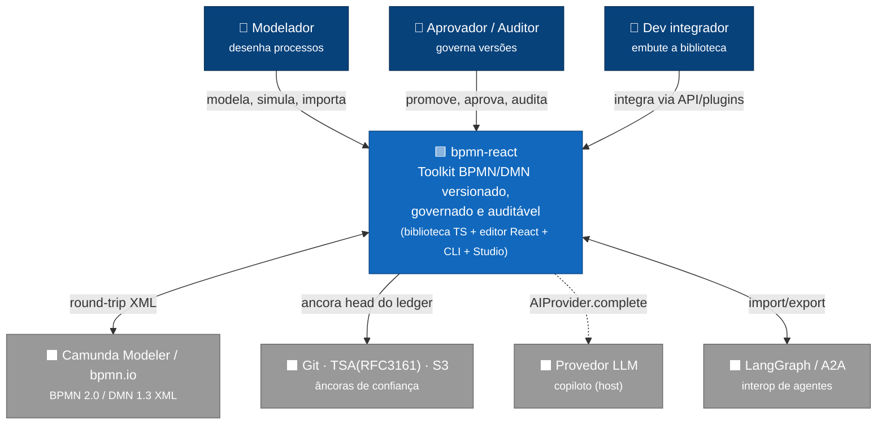

**Decisões-chave (L1):** o sistema é **biblioteca embarcável**, não serviço. Não
possui backend próprio nem armazena dados — persistência, rede e chaves são
responsabilidade do **host** via portas injetadas. A interoperabilidade com o
ecossistema BPMN é feita por **formato** (XML), não por API remota.

## C4-L2 · Contêineres

**Objetivo:** unidades de distribuição/execução e como se comunicam.

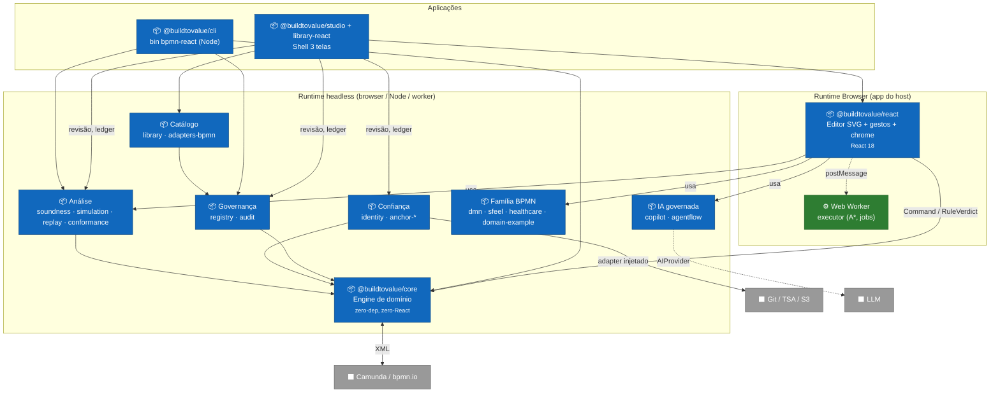

**Decisões-chave (L2):** contêiner **`core` é o hub estável** (dependido por
todos, depende de ninguém). A camada `react` é o único contêiner que toca o DOM.
Governança, confiança, análise, família BPMN e IA são contêineres **headless
independentes** que se compõem por injeção. Studio e CLI são os dois pontos de
entrada de aplicação (UI e linha de comando) sobre o mesmo núcleo.

## C4-L3 · Componentes (por subsistema)

### L3.1 — Componentes de `core`

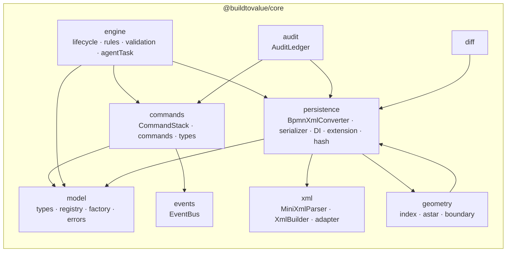

**Nota:** `commands`/`model` **não** dependem de `engine` — inversão deliberada
(`RuleEngine` implementa a interface `CommandInterceptor` definida em `commands`).

### L3.2 — Componentes de `react`

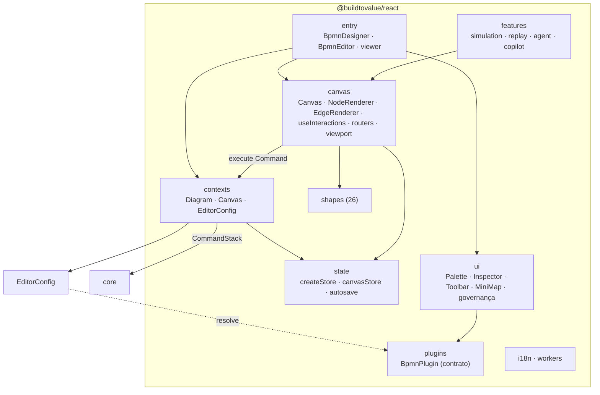

### L3.3 — Governança & Confiança

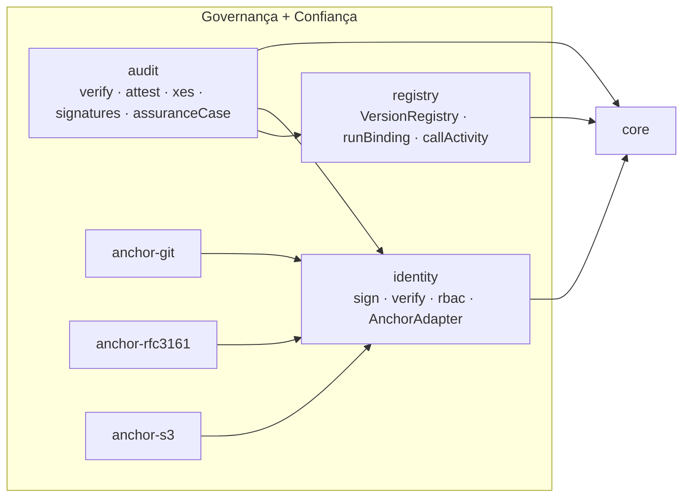

### L3.4 — Análise & Família BPMN

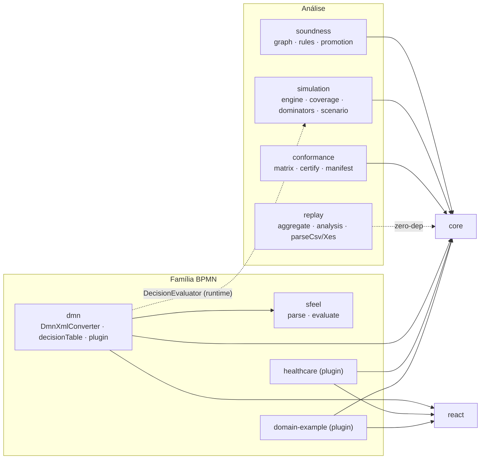

### L3.5 — IA governada · Catálogo · Aplicações

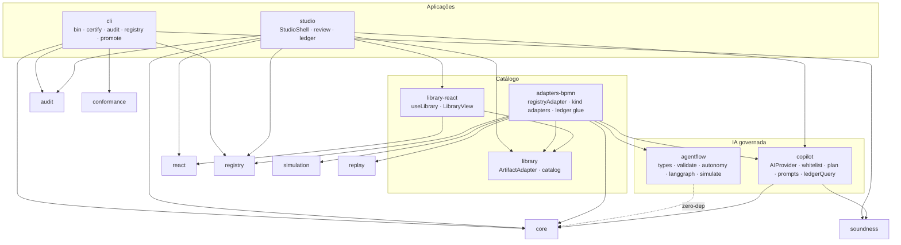

## C4-L4 · Código

O nível de código (classes, atributos, métodos, relações) está detalhado em
**`docs/uml/analise-uml.md` §6** (6 diagramas de classe por camada) e §12
(rastreabilidade entidade → arquivo). Resumo das abstrações-âncora:

| Abstração | Papel arquitetural | Arquivo |
|---|---|---|
| `Command` / `CommandInterceptor` | Seam de mutação reversível + veto (DIP) | `core/commands/types.ts` |
| `EventBus` | Observador com prioridade/veto/transform | `core/events/EventBus.ts` |
| `NodeTypeRegistry` | Autoridade de tipos (Open/Closed via plugin) | `core/model/registry.ts` |
| `BpmnPlugin` | Ponto de extensão declarativo | `react/plugins/types.ts` |
| `AnchorAdapter` / `Signer` / `AIProvider` | Portas hexagonais | `identity`, `copilot` |
| `ArtifactAdapter` | Contrato de catálogo genérico | `library/types.ts` |

---

# Parte II — Vistas 4+1

## Vista Lógica

Camadas e a direção (única) das dependências — de aplicação para domínio.

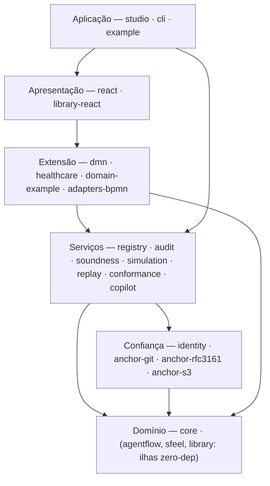

**Regra de dependência (Clean Architecture):** setas só apontam "para dentro"
(domínio estável). Nenhum ciclo entre pacotes. Ilhas zero-dep (`sfeel`,
`agentflow`, `library`, `replay`) não dependem nem do domínio.

## Vista de Processo

Concorrência real do sistema (JS single-thread + workers + filas de Promise).

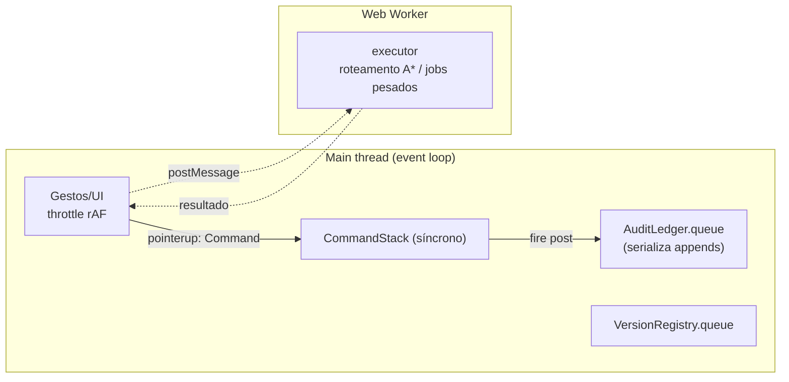

**Nota:** não há paralelismo de domínio (sem threads/locks). As "filas" são
*sincronização de ordem* para o hash-chain, não paralelismo. Trabalho pesado é
isolado no worker para não travar 60fps.

## Vista de Desenvolvimento

Organização física do código e o grafo de build.

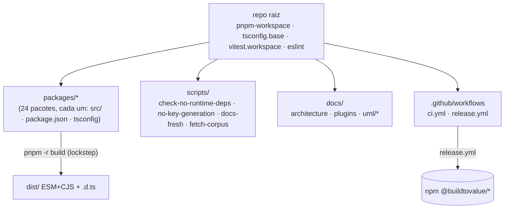

## Vista Física

Topologia de distribuição/execução (biblioteca — sem IaC; ver `analise-uml.md §9`).

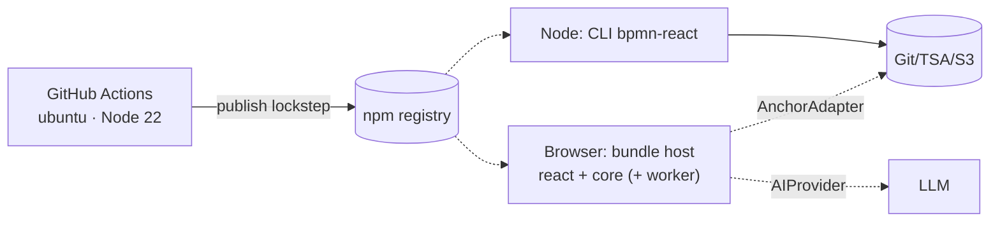

## Vista de Cenários (4+1)

Os cenários que amarram as demais vistas (casos de uso → sequências) estão em
`analise-uml.md`: **§3** (casos de uso) e **§7** (5 diagramas de sequência: editar
nó, importar XML, promover versão, aprovar+assinar+ancorar, simular/copiloto).
Cenário-síntese do fluxo de valor governado:

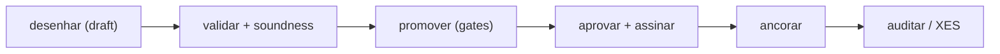

---

# Parte III — Arquitetura por pacote

Um diagrama compacto por pacote: **módulos internos** (nós) e **dependências
externas** (`@buildtovalue/*`, à direita). Ordenados por camada.

### `core` — engine de domínio (zero-dep)
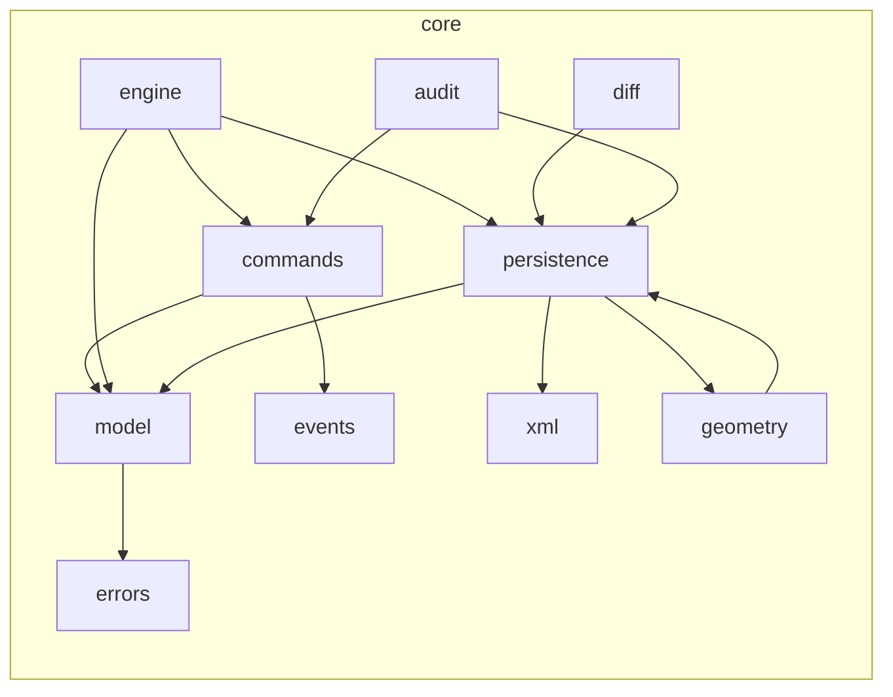
**Padrões:** Command, Interceptor, Observer, Registry, Facade (XML), Factory.
**Atributo dominante:** *portabilidade* (headless) + *auditabilidade*.

### `react` — apresentação
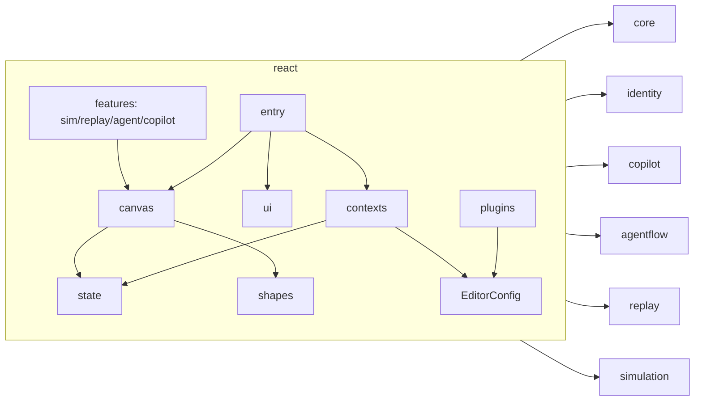
**Padrões:** External Store (useSyncExternalStore), Strategy (routers), Plugin.
**Atributo:** *desempenho* (re-render granular, 60fps) + *extensibilidade*.

### `registry` — governança consultável
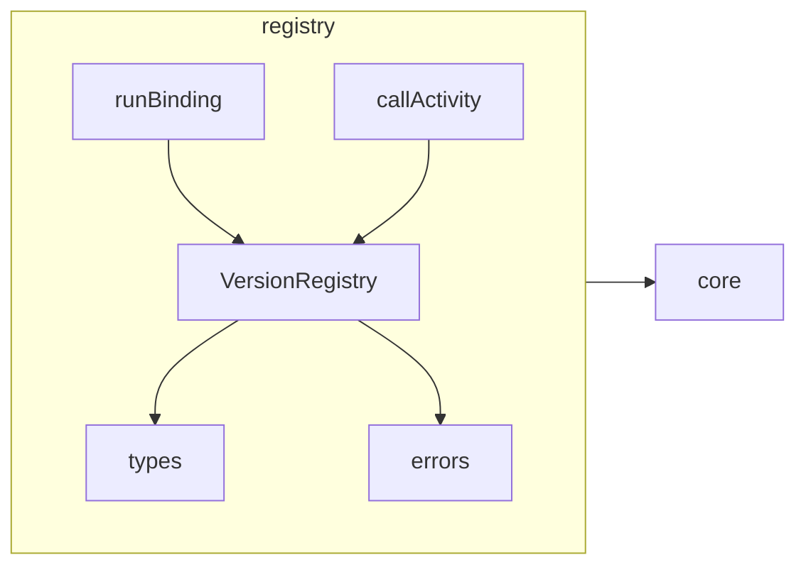
**Padrões:** Repository / Read-Model (CQRS-ish), imutabilidade temporal.

### `audit` — integridade demonstrável
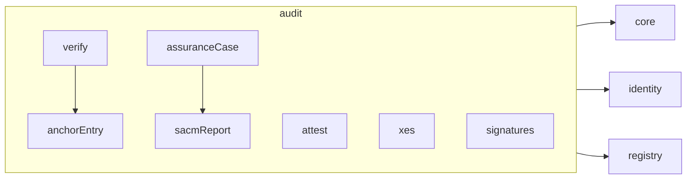
**Padrões:** funções puras sobre `LedgerLike`; verificação por recomputação de hash.

### `identity` — assinatura + contrato de âncora
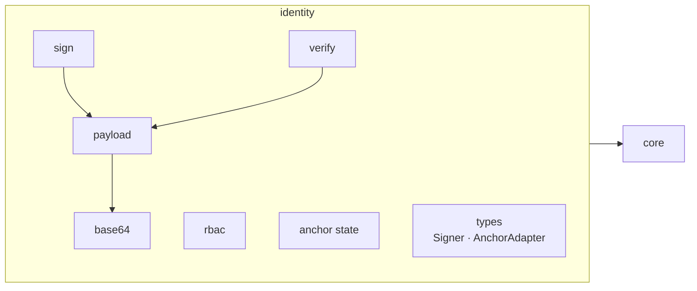
**Padrões:** Ports & Adapters (define portas `Signer`/`AnchorAdapter`); zero-key.

### `anchor-git` · `anchor-rfc3161` · `anchor-s3` — âncoras de confiança
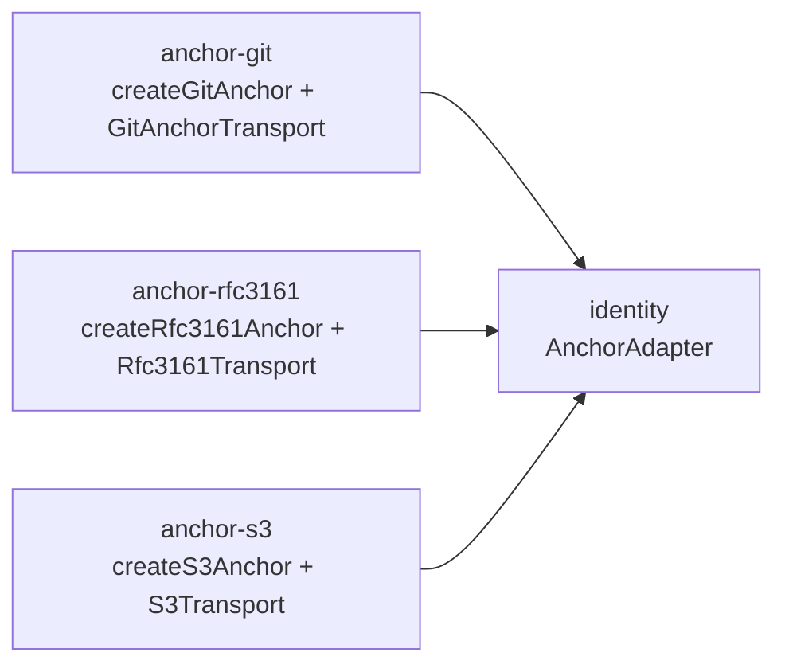
**Padrão:** Adapter — três implementações do **mesmo** contrato via transporte injetado.

### `soundness` — análise estrutural
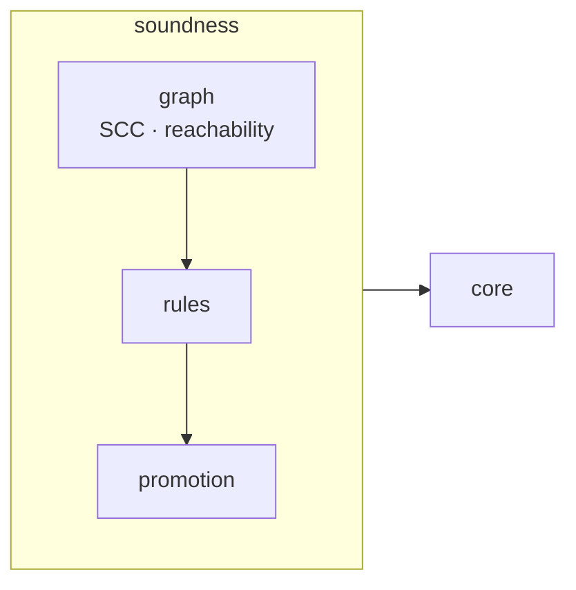
**Padrão:** Strategy de regras; entrega `ValidationRule[]` + `PromotionRule` (plug-in).

### `simulation` — engine de tokens
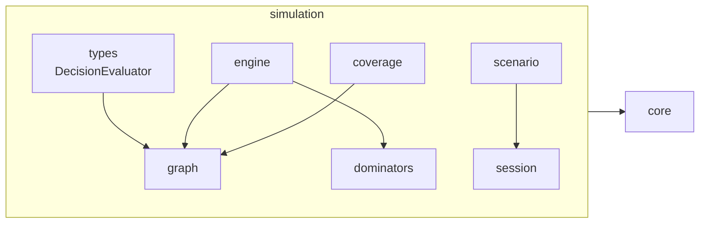
**Padrão:** State machine determinística; porta `DecisionEvaluator` (DIP p/ dmn).

### `replay` — token-replay (ilha zero-dep)
```mermaid
flowchart LR
  subgraph replay
    ty[types<br/>ReplayGraph injetado] --> ag[aggregate]
    ag --> an[analysis]
    pc[parseCsv] & px[parseXes] --> ty
  end
```
**Padrão:** raciocina sobre grafo **injetado** — nem importa `core`. *Reusabilidade máxima.*

### `conformance` — certificação OMG
```mermaid
flowchart LR
  subgraph conformance
    mx[matrix] --> rn[render]
    cf[certify] --> mn[manifest]
    cp[corpusPolicy]
  end
  conformance --> core
```
**Padrão:** `certifyXml` puro (well-formed + XXE + round-trip + classe atingida).

### `dmn` — família DMN (plugin + ferramentas)
```mermaid
flowchart LR
  subgraph dmn
    md[model] --> pg[plugin]
    cv[DmnXmlConverter] --> dt[decisionTable] --> dx[decisionTableXml]
    ss[sfeelSupport] --> dt
    sh[shapes] --> pg
  end
  dmn --> core & react & sfeel
```
**Padrão:** Facade (converter) + Adapter (`sfeelSupport` → `DecisionEvaluator`).

### `sfeel` — subconjunto S-FEEL (ilha zero-dep)
```mermaid
flowchart LR
  subgraph sfeel
    ty[types] --> ps[parse]
    ps --> ev[evaluate]
  end
```
**Padrão:** "contrato de honestidade" — só retorna match / null / `nonSimulable`.

### `healthcare` · `domain-example` — plugins de domínio
```mermaid
flowchart LR
  HC["healthcare<br/>model · plugin · shapes"] --> coreH[core] & reactH[react]
  DE["domain-example<br/>nodeTypes · edgeStyles · rules · shapes"] --> coreH & reactH
```
**Padrão:** Plugin declarativo (`BpmnPlugin`) — vocabulário de domínio sem fork.

### `copilot` — IA governada
```mermaid
flowchart LR
  subgraph copilot
    ty[types<br/>AIProvider] --> wl[whitelist]
    pl[plan] --> wl & ty
    pr[prompts]
    lq[ledgerQuery]
  end
  copilot --> core & soundness
```
**Padrão:** Ports (`AIProvider`) + validação integral + whitelist (segurança).
**Restrição:** sem caminho de import para `identity` (imposto em CI).

### `agentflow` — modelo de agente (ilha zero-dep)
```mermaid
flowchart LR
  subgraph agentflow
    ty[types<br/>AgentWorkflow] --> rf[ref]
    au[autonomy] --> ty
    gr[graph] --> ty
    vl[validate] --> gr & au
    lg[langgraph] --> ty
    sm[simulate] --> st[simTypes]
    tp[templates]
  end
```
**Padrão:** modelo JSON puro + interop (LangGraph); autonomia 0–5 ("o grafo manda").

### `library` — contrato de catálogo (ilha zero-dep)
```mermaid
flowchart LR
  subgraph library
    ty[types<br/>ArtifactAdapter] --> ad[adapters]
    ca[catalog] --> ty
  end
```
**Padrão:** Contrato + engine headless (busca/filtro/ordenação). Não conhece BPMN.

### `library-react` — galeria genérica
```mermaid
flowchart LR
  subgraph libreact
    ul[useLibrary] --> lv[LibraryView]
    lv --> ac[ArtifactCard] & dr[ArtifactDrawer] & th[Thumbnail]
  end
  libreact --> library & react
```
**Padrão:** UI dirigida 100% pelo contrato `ArtifactAdapter` (inversão de UI).

### `adapters-bpmn` — adaptadores concretos + cola de ledger
```mermaid
flowchart LR
  subgraph adapters
    cl[classify] --> ra[registryAdapter]
    ra --> ad[kind adapters<br/>flow·persona·prompt·connector·policy]
    dd[dmnDecisionAdapter] --> ra
    th[thumbnails]
    rec[recipe/roteiro/agent/copilotPrompt adapters]
    lg[ledger glue<br/>simulation · replay · agentSim]
    ag[agentGovernance]
  end
  adapters --> core & registry & library & agentflow & copilot & simulation & replay
```
**Padrão:** Adapter (Registry → `ArtifactAdapter`); ponto de fan-in do ecossistema.

### `studio` — shell de aplicação
```mermaid
flowchart LR
  subgraph studio
    sh[StudioShell] --> rv[review<br/>queue·checks·decide·ReviewScreen]
    sh --> lg[ledger<br/>categorize·LedgerExplorer]
  end
  studio --> core & registry & soundness & conformance & audit & identity & copilot & react & library & library-react
```
**Padrão:** Facade de aplicação; telas sobre funções puras. Maior fan-out (topo).

### `cli` — linha de comando
```mermaid
flowchart LR
  subgraph cli
    bn[bin] --> ix[index<br/>validate·export·diff]
    bn --> ce[certify] & au[audit] & rg[registry] & pm[promote]
    io[io]
  end
  cli --> core & audit & conformance & registry & soundness
```
**Padrão:** Command pattern de CLI; reusa engines headless (sem UI).

### `example` — app-demo (privado)
```mermaid
flowchart LR
  subgraph example
    mn[main] --> ap[App]
    ap --> ss[StudioSurface] & ls[LibrarySurface] & lp[LifecyclePanel] & au[AuditPanel] & sd[sampleDiagram]
  end
  example -->|exercita ~16 pacotes| todos["(todos)"]
```
**Padrão:** composição de plugins; ~29 specs Playwright cobrindo cada modo.

---

# Parte IV — Vistas transversais

## IV.1 — Arquitetura de plugins (pontos de extensão)

```mermaid
flowchart TB
  Plugin["BpmnPlugin (objeto declarativo)"]
  Plugin -->|nodeTypes| Reg["NodeTypeRegistry"]
  Plugin -->|shapes/palette/inspector| UI["chrome React"]
  Plugin -->|validationRules| VE["ValidationEngine"]
  Plugin -->|registerRules| RE["RuleEngine"]
  Plugin -->|lifecycleConfig| LE["LifecycleEngine"]
  Plugin -->|edgeRouter| Rt["Strategy de roteamento"]
  Plugin -->|onEditorEvent| Obs["observabilidade (EDITOR_EVENTS)"]
  Plugin -->|onBeforeSave/onAfterLoad| Xml["pipeline XML"]
  resolveEditorConfig["resolveEditorConfig(plugins)"] --> Plugin
```
Extensão sem fork (**Open/Closed**): DMN, Healthcare e Domain-Example são apenas
plugins. Nenhum campo é obrigatório — de uma regra a um vocabulário inteiro.

## IV.2 — Ports & Adapters (hexagonal)

```mermaid
flowchart LR
  subgraph Núcleo["Núcleo de aplicação (bibliotecas)"]
    P1["«port» Signer"]
    P2["«port» AnchorAdapter"]
    P3["«port» AIProvider"]
    P4["«port» RegistrySink / AuditSink"]
    P5["«port» DecisionEvaluator"]
    P6["«port» XmlParserAdapter / Serializer"]
    P7["«port» ArtifactAdapter"]
  end
  H1["host: chave privada"] --> P1
  H2["anchor-git/rfc3161/s3"] --> P2
  H3["host: LLM"] --> P3
  H4["host: DB/API/arquivo"] --> P4
  H5["dmn+sfeel"] --> P5
  H6["Mini/DomXmlAdapter · JsonSerializer"] --> P6
  H7["adapters-bpmn"] --> P7
```
Tudo que é rede, criptografia de chave ou LLM fica **fora** das bibliotecas —
adaptadores injetados. *Testabilidade* e *segurança* como propriedades estruturais.

## IV.3 — Cadeia de confiança & auditoria

```mermaid
flowchart LR
  Cmd["Command.post"] -->|prio -100| Led["AuditLedger.append<br/>SHA-256 encadeado"]
  Led --> Vf["verify() recomputa cadeia"]
  Prom["VERSION_ACTIVATED"] --> Led
  Sig["signApproval (Ed25519)"] --> Led
  Anc["AnchorAdapter.anchor"] -->|receipt| Led
  Led --> Xes["toXES / assuranceCase (SACM)"]
```

## IV.4 — Segurança por design (Security by Design)

```mermaid
flowchart TB
  S1["XML: rejeita DOCTYPE/DTD → imune a XXE"]
  S2["XmlBuilder escapa atributo/texto"]
  S3["Chave privada nunca cruza (Signer no host)"]
  S4["Ledger hash-chain: adulteração detectável"]
  S5["Copiloto: whitelist de 7 comandos; sem acesso a governança/identity"]
  S6["CI: pnpm audit high + no-key-generation + no-runtime-deps"]
```

## IV.5 — DevOps / CI-CD

```mermaid
flowchart LR
  PR["push / PR → main"] --> J1["build-test<br/>install · audit · checks · lint · build · typecheck · coverage"]
  PR --> J2["e2e<br/>Playwright + Chromium"]
  Tag["release.yml"] --> Pub["publish lockstep semver → npm"]
  J1 --> Gate{"verde?"}
  Gate -->|sim| Merge["merge"]
```
Guardas arquiteturais executáveis: `apiSurface.test.ts` (congela superfície),
`check-docs-fresh`, `check-no-runtime-deps`, `check-no-hardcoded-strings`.

---

# Parte V — Atributos de qualidade e recomendações

## V.1 — Avaliação de atributos de qualidade (-ilities)

| Atributo | Nota | Evidência arquitetural | Risco/observação |
|---|---|---|---|
| **Portabilidade** | ★★★★★ | `core` headless roda browser/Node/worker; zero-dep | — |
| **Manutenibilidade** | ★★★★☆ | camadas claras, DIP, sem ciclos | `react` volumoso (143 arq.) |
| **Testabilidade** | ★★★★★ | funções puras + portas injetáveis; ~475 fontes com specs/e2e | — |
| **Extensibilidade** | ★★★★★ | `BpmnPlugin` Open/Closed; registries | contrato de plugin em `react` (ver rec. R2) |
| **Segurança** | ★★★★★ | XXE-safe, zero-key, hash-chain, whitelist IA, CI audit | — |
| **Auditabilidade** | ★★★★★ | ledger SHA-256 + attest + XES + SACM | — |
| **Desempenho** | ★★★★☆ | store granular, rAF, worker, dicionários O(1) | SVG ~300–400 elementos (virtualização no roadmap) |
| **Interoperabilidade** | ★★★★★ | round-trip BPMN 2.0 / DMN 1.3; corpus 50+; certify | perfil documentado, não XSD full |
| **Confiabilidade** | ★★★★☆ | imutabilidade temporal; undo/redo; validação+soundness | — |
| **Reusabilidade** | ★★★★☆ | ilhas zero-dep (`sfeel`,`agentflow`,`library`,`replay`) | duplicação de grafo (ver R1) |
| **Escalabilidade (colab.)** | ★★☆☆☆ | — | sem CRDT/multiusuário (roadmap declarado) |

## V.2 — Aderência a SOLID

- **SRP** ✔ — cada pacote/módulo tem uma responsabilidade única e nomeável.
- **OCP** ✔ — extensão por plugin/registry sem alterar o núcleo.
- **LSP** ✔ — implementações de porta (3 `AnchorAdapter`, 2 `XmlParserAdapter`,
  2 `Serializer`) são substituíveis.
- **ISP** ✔ — portas minúsculas (`Signer.sign`, `AuditSink.write`,
  `DecisionEvaluator` com 3 métodos).
- **DIP** ✔ — `commands` não conhece `engine`; `simulation` não conhece `dmn`;
  `copilot` não conhece `identity`. Inversão via interfaces/funções.

## V.3 — Recomendações priorizadas

| # | Prioridade | Recomendação | Atributo alvo | Esforço |
|---|---|---|---|---|
| **R1** | Alta | Promover `isFlowNode`/`flowScopeOf`/`gatewayKindOf` (duplicados em `soundness` e `simulation`) para um módulo `core/graph`. | Manutenibilidade | Baixo |
| **R2** | Alta | Separar `HeadlessPlugin` (regras, tipos, lifecycle, router) em `core`; `BpmnPlugin` (shapes, palette, inspector) estende em `react`. Remove o dep `react` de `dmn` no caminho headless. | Manutenibilidade, Reusabilidade | Médio |
| **R3** | Média | Extrair entry points/subpacotes tree-shakeable de `react` (`/simulation`, `/replay`, `/copilot`) — já há precedente em `/viewer`. | Desempenho (bundle) | Médio |
| **R4** | Média | Micropacote `@buildtovalue/sim-contracts` com os tipos que `agentflow/simTypes` espelha de `simulation` — elimina drift estrutural. | Confiabilidade | Baixo |
| **R5** | Média | Vigiar `studio` (fan-out 10) para não virar *god package*; manter cada tela sobre funções puras isoladas. | Manutenibilidade | Contínuo |
| **R6** | Baixa | Planejar remoção dos `DEPRECATED_EVENT_ALIASES` no próximo major (dívida de compat semver). | Manutenibilidade | Baixo |
| **R7** | Baixa | Virtualização/canvas fallback para diagramas > ~400 elementos (roadmap). | Desempenho, Escalabilidade | Alto |
| **R8** | Estratégica | Camada de colaboração multiusuário (CRDT) como *layer* opcional, preservando o modelo de comandos imutáveis. | Escalabilidade | Alto |

## V.4 — Riscos arquiteturais residuais

- **Acoplamento de contrato de plugin à camada React** (R2) — pacotes
  conceitualmente headless (`dmn`) arrastam `react` só pelo tipo.
- **Duplicação estrutural sincronizada por teste** (R1, R4) — funciona, mas
  depende de disciplina de teste para não divergir.
- **Superfície pública ampla de `react`** — mitigada por `apiSurface.test.ts`,
  mas cresce o custo de manutenção do contrato semver.

> Nenhum risco crítico: não há ciclos de dependência, o núcleo é estável e
> zero-dep, e as fronteiras de segurança são estruturais e verificadas em CI.
